<p align="center">
  
</p>

# DevOps Open Agent v2

**DevOps Open Agent** is an open-source, self-hostable, AI-powered DevOps troubleshooting platform. It helps DevOps engineers, SREs, and platform teams investigate infrastructure issues, optimize cloud costs, review pull requests, debug performance, and scan for security vulnerabilities with DevOps-focused AI guidance — reactively on demand or **proactively on a schedule** — then deliver recommendations to **Slack**, **Microsoft Teams**, and **PagerDuty** without alert fatigue.

<p align="center">
  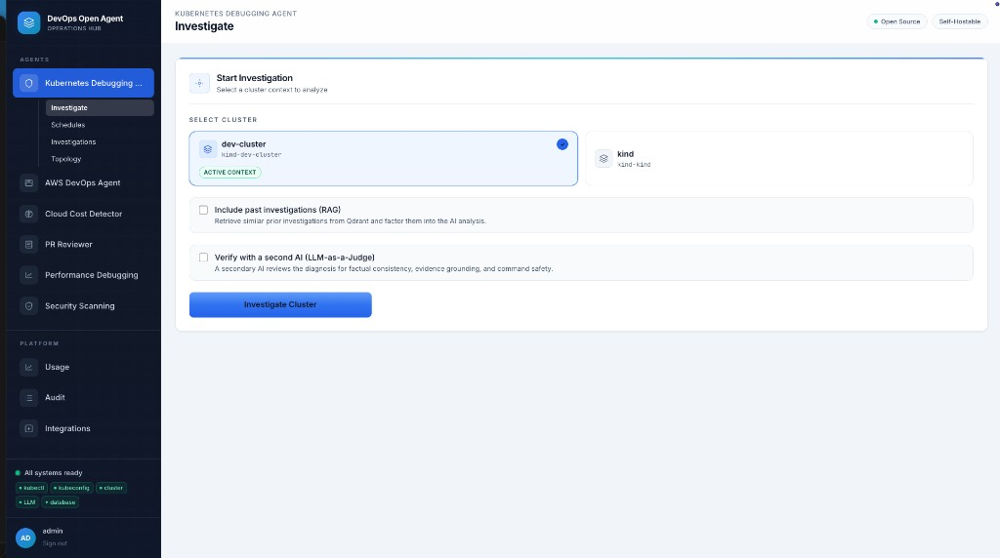
</p>

*DevOps Open Agent v2 — Operations Hub with agents, Usage / Audit / Integrations, and AI-powered Kubernetes investigations.*

## Modules

| Module | Description |
|--------|-------------|
| **Kubernetes Debugging Agent** | Investigate clusters, workloads, networking, and topology — **on demand or on a schedule** — with optional **LLM-as-a-Judge** verification |
| **AWS DevOps Agent** | Troubleshoot AWS infrastructure — EC2, **Lambda**, **S3**, VPC, load balancers, CloudWatch, and more — with optional **multi-account STS AssumeRole** |
| **Cloud Cost Detector** | Find unused and underutilized AWS resources |
| **PR Reviewer** | AI DevOps review for GitHub pull requests |
| **Performance Debugging** | Debug Linux host performance over passwordless SSH — CPU, memory, disk, and network + AI analysis |
| **Security Scanning** | Scan container images and Kubernetes clusters for vulnerabilities and misconfigurations using **Trivy**, with AI-prioritized remediation |
| **Integrations** | **Slack**, **Microsoft Teams**, **PagerDuty**, **MCP**, **Qdrant (RAG)**, **Prometheus**, **Grafana**, and **AWS Accounts** — notifications, on-call, tools, RAG, observability evidence, and multi-account AssumeRole |

## Demo Video

Watch a full walkthrough of DevOps Open Agent v2 — how the platform works across all six agents, AI root cause analysis, and Slack, Microsoft Teams, and PagerDuty integrations.

<p align="center">
  <a href="https://youtu.be/9HjWLyoHdng">
    
  </a>
</p>

**[▶ Watch on YouTube](https://youtu.be/9HjWLyoHdng)**

The demo covers:

1. **Platform overview** — one UI for Kubernetes, AWS, cloud cost, and PR review workflows  
2. **Live investigations** — discovery, evidence collection, topology, and progress tracking  
3. **AI diagnosis** — root cause, suggested fixes, confidence scores, and validation steps  
4. **Integrations** — Slack, Microsoft Teams, and PagerDuty notifications from AI recommendations  
5. **Proactive schedules** — recurring Kubernetes investigations with AI diagnosis  
6. **Self-hosted setup** — running locally with Docker Compose and your choice of LLM provider  

## Tech Stack

- **Backend:** Python 3.12, FastAPI, SQLite, PostgreSQL (auth + schedules), APScheduler, shared LLM providers
- **Frontend:** Next.js 15, TypeScript, Tailwind CSS, TanStack Query
- **Runtime:** Docker Compose

Supported LLM providers: OpenAI, Anthropic, OpenRouter, Google Gemini, AWS Bedrock, Ollama — see [LLM Supported](#llm-supported).

## Quick Install

For **local development** (localhost). On a new remote host, use [New host checklist](#new-host-checklist) instead.

```bash
chmod +x install.sh
./install.sh
```

Custom admin password:

```bash
./install.sh --admin-pass 'MySecurePass123'
```

Configure only (no Docker build):

```bash
./install.sh --skip-build
```

The installer will:

1. Verify Docker and Compose
2. Create `backend/.env` from `backend/.env.example` if missing
3. Set default username `admin` and password
4. Generate a random `JWT_SECRET`
5. Build and start all services with Docker Compose

## Default Login

| Field | Value |
|-------|-------|
| Username | `admin` |
| Password | `admin123` (or value passed to `--admin-pass`) |

Sign in at [http://localhost:3000/login](http://localhost:3000/login).

Change the password in `backend/.env` before production:

```env
DEFAULT_ADMIN_PASSWORD=your-secure-password
```

Then restart:

```bash
docker compose up -d --force-recreate backend
```

> **Note:** If an older install already created `admin@example.com`, delete the Postgres volume or sign up a new user. Fresh installs use username `admin`.

### Authentication today and roadmap

DevOps Open Agent currently uses **self-hosted username/password auth**:

- Passwords stored as **bcrypt** hashes in PostgreSQL
- Successful login/signup returns a signed **JWT** bearer token
- Protected APIs require `Authorization: Bearer <token>`

**Roadmap:** OAuth and integration with external identity providers (for example Google, GitHub, and enterprise SSO/IdP options) are planned so teams can use their existing identity stack instead of only local accounts.

## Prerequisites

- macOS or Linux
- [Docker Desktop](https://www.docker.com/products/docker-desktop/) (macOS) or Docker Engine + Compose (Linux)
- Optional: [Ollama](https://ollama.com/) for local AI
- Optional: `~/.kube/config` for Kubernetes investigations
- Optional: `~/.aws/credentials` for AWS and Cloud Cost modules
- Optional: GitHub token for PR Reviewer
- Optional: passwordless SSH (`~/.ssh`) for Performance Debugging

### Verify prerequisites

Run these checks before `./install.sh` to confirm everything is in place.

**Docker**

```bash
docker info > /dev/null 2>&1 && echo "✅ Docker is running" || echo "❌ Docker is not running — start Docker Desktop or the Docker daemon"
```

**Docker Compose**

```bash
docker compose version > /dev/null 2>&1 && echo "✅ Docker Compose is available" || echo "❌ Docker Compose not found — install Compose v2"
```

**Python 3**

```bash
python3 --version > /dev/null 2>&1 && echo "✅ Python 3 is installed ($(python3 --version))" || echo "❌ Python 3 not found — install Python 3.12+"
```

**Ollama (optional — for local AI)**

```bash
curl -sf http://127.0.0.1:11434/api/tags > /dev/null && echo "✅ Ollama is reachable" || echo "⚠️  Ollama is not running — start Ollama or set a cloud LLM_PROVIDER in backend/.env"
```

**Kubernetes (optional)**

```bash
[ -f ~/.kube/config ] && echo "✅ Kubeconfig found" || echo "⚠️  ~/.kube/config not found — Kubernetes investigations will not work"
```

**AWS (optional)**

```bash
[ -d ~/.aws ] && echo "✅ AWS credentials directory found" || echo "⚠️  ~/.aws not found — AWS and Cloud Cost modules will need credentials"
```

### Ubuntu one-line installs

Use these commands on Ubuntu to install common dependencies before running `./install.sh`.

**Docker**

```bash
curl -fsSL https://get.docker.com | sudo sh
```

After install, add your user to the Docker group (log out/in or reboot afterward):

```bash
sudo usermod -aG docker "$USER"
```

**Ollama (local LLM)**

```bash
curl -fsSL https://ollama.com/install.sh | sh
```

Pull a model (example used by default in `backend/.env.example`):

```bash
ollama pull gemma4:e4b
```

**Kind (local Kubernetes cluster)**

```bash
curl -Lo ./kind https://kind.sigs.k8s.io/dl/latest/kind-linux-amd64 && chmod +x ./kind && sudo mv ./kind /usr/local/bin/kind
```

**AWS CLI v2**

```bash
sudo apt update && sudo apt install -y python3 python3-pip curl unzip && curl "https://awscli.amazonaws.com/awscli-exe-linux-$(uname -m).zip" -o awscliv2.zip && unzip -q awscliv2.zip && sudo ./aws/install
```

Configure credentials:

```bash
aws configure
```

**kubectl**

```bash
curl -LO "https://dl.k8s.io/release/$(curl -L -s https://dl.k8s.io/release/stable.txt)/bin/linux/amd64/kubectl" && chmod +x kubectl && sudo mv kubectl /usr/local/bin/
```

> **Note:** The Kind and kubectl commands above target `linux/amd64`. On ARM64 Ubuntu, replace `amd64` with `arm64` in the download URLs.

## LLM Supported

All agent modules (Kubernetes, AWS, Cloud Cost, PR Reviewer, Performance Debugging, Security Scanning) use a **shared LLM layer**.  
Configure one provider in `backend/.env` — every investigation, diagnosis, and PR review uses it. Kubernetes investigations can optionally use a **separate provider/model for LLM-as-a-Judge** verification (see [LLM-as-a-Judge](#llm-as-a-judge-ai-verification)).


| Provider | `LLM_PROVIDER` | Configure in `backend/.env` |
|----------|--------------|-------------------------------|
| **Ollama** | `ollama` | `OLLAMA_BASE_URL`, `OLLAMA_MODEL` — local / self-hosted |
| **OpenAI** | `openai` | `OPENAI_API_KEY`, `OPENAI_MODEL` |
| **Anthropic** | `anthropic` | `ANTHROPIC_API_KEY`, `ANTHROPIC_MODEL` |
| **OpenRouter** | `openrouter` | `OPENROUTER_API_KEY`, `OPENROUTER_MODEL` |
| **Google Gemini** | `gemini` | `GEMINI_API_KEY`, `GEMINI_MODEL` |
| **AWS Bedrock** | `bedrock` | `BEDROCK_MODEL`, optional `BEDROCK_REGION` / `BEDROCK_AWS_PROFILE` (uses AWS credential chain) |

## LLM Usage & Cost

DevOps Open Agent meters token usage across the shared LLM layer and shows estimated spend in the UI — so teams can see what AI analysis is costing and get alerted before spend surprises finance.

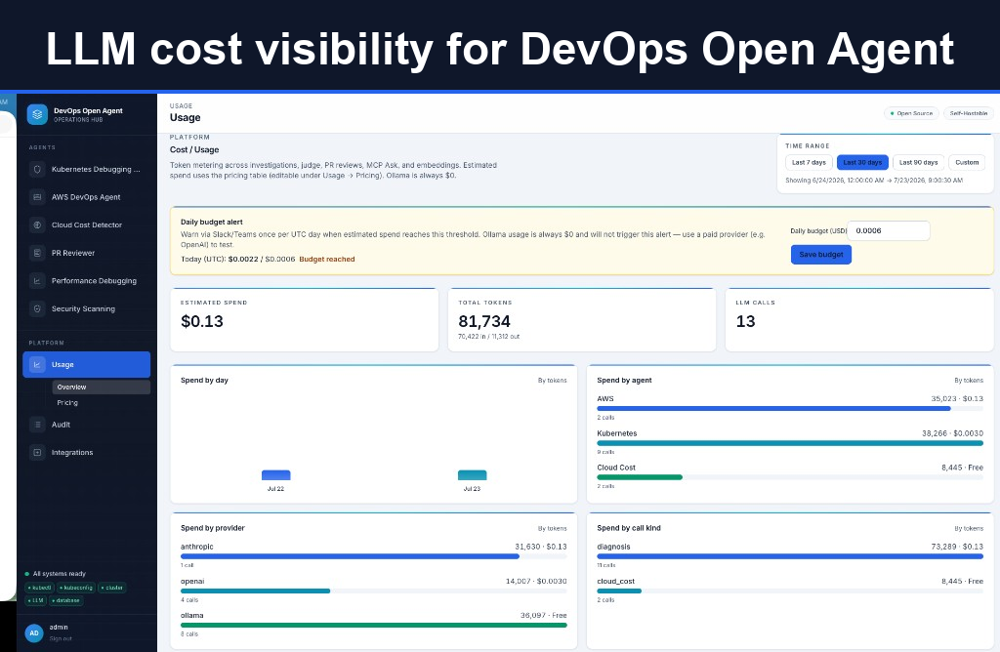

| Surface | What you get |
|---------|----------------|
| **Usage** (`/usage`) | Spend and tokens by day, agent, provider, and call kind; date-range filters |
| **Investigation detail / history** | Per-run token totals and estimated USD |
| **Daily budget** | Per-user USD threshold on the Usage page; Slack/Teams alert once per UTC day when today’s **total** estimated spend crosses it |
| **Pricing** (`/usage/pricing`) | Editable rates (`input_per_1m_usd` / `output_per_1m_usd`) used for estimates |

**Notes**

- Estimates are approximate (not live invoice sync). **Ollama is always $0** but still records tokens.
- Unknown models record tokens with no estimated USD until you add them under Usage → Pricing.
- Runtime pricing is stored on the data volume at `data/pricing_table.json` (seeded from `backend/app/ai/pricing_table.json`). Editing either path works; UI edits survive container restarts when the volume is mounted.
- Budget alerts require Slack and/or Teams to be enabled under Integrations. Alerts use today’s UTC spend across **all** providers, not per-model.

**Audit log:** open **Audit** in the sidebar (`/audit`) to see who started investigations and who changed integration settings.

Example (`backend/.env`):

```env
# Anthropic
LLM_PROVIDER=anthropic
ANTHROPIC_API_KEY=sk-ant-...
ANTHROPIC_MODEL=claude-sonnet-4-6

# OpenRouter (100+ models through one API key)
# LLM_PROVIDER=openrouter
# OPENROUTER_API_KEY=sk-or-...
# OPENROUTER_MODEL=openai/gpt-4o-mini

# Google Gemini
# LLM_PROVIDER=gemini
# GEMINI_API_KEY=...
# GEMINI_MODEL=gemini-2.0-flash

# AWS Bedrock (Claude / Llama / etc. via Converse API)
# Enable model access in the Bedrock console for your account/region.
# Prefer an inference profile ID when the base model requires it
# (e.g. us.anthropic.claude-sonnet-4-6).
# LLM_PROVIDER=bedrock
# BEDROCK_MODEL=anthropic.claude-3-5-sonnet-20241022-v2:0
# BEDROCK_REGION=us-west-2
# BEDROCK_AWS_PROFILE=   # optional; otherwise AWS_PROFILE / default chain
```

IAM needs at least `bedrock:InvokeModel` (and `bedrock:InvokeModelWithResponseStream` if streaming is used later). To discover available TEXT models with your credentials:

```bash
curl -s -H "Authorization: Bearer <token>" \
  http://localhost:8000/api/v1/system/llm/bedrock/models | jq .
```


After changing provider settings, recreate the backend so `backend/.env` is reloaded:

```bash
docker compose up -d --force-recreate backend
```

## Integrations

Deliver AI recommendations from investigations and PR reviews to the tools your team already uses — enrich AI analysis with MCP servers — and pull **Prometheus/Grafana observability evidence** into Kubernetes and AWS investigations. Configure everything under **Integrations** in the UI.

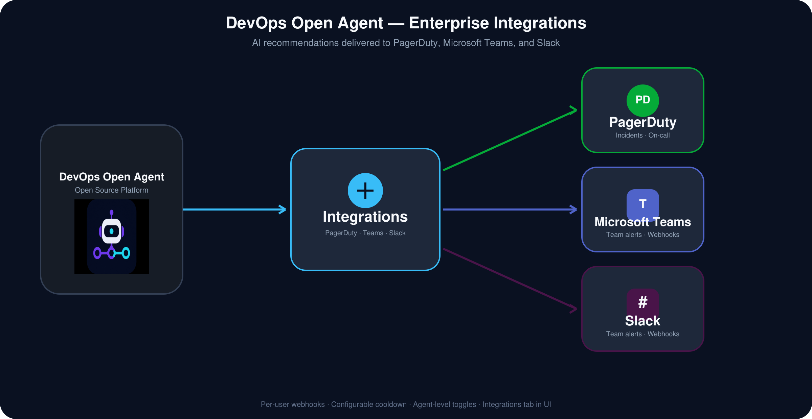

Regenerate the diagram: `python3 scripts/build_integrations_diagram.py`

| Integration | UI path | Best for |
|-------------|---------|----------|
| **Slack** | Integrations → Slack | Team chat alerts, webhooks, channel delivery |
| **Microsoft Teams** | Integrations → Teams | Team chat alerts via incoming webhook |
| **PagerDuty** | Integrations → PagerDuty | On-call incidents, Events API v2, enterprise alerting |
| **MCP** | Integrations → MCP | External tools & resources via Model Context Protocol |
| **Qdrant (RAG)** | Integrations → Qdrant | Store investigations as vectors; retrieve similar past cases for AI analysis |
| **Prometheus** | Integrations → Prometheus | Host/EC2 + Kubernetes metrics evidence for AI diagnosis |
| **Grafana** | Integrations → Grafana | Dashboard/annotation hits for Kubernetes and AWS investigations |
| **AWS Accounts** | Integrations → AWS Accounts | STS AssumeRole targets for multi-account AWS investigate + topology |

Slack, Microsoft Teams, and PagerDuty support:

- Per-user settings stored in PostgreSQL
- Per-agent toggles (Kubernetes, AWS, Cloud Cost, PR Reviewer)
- Configurable alert cooldown to reduce fatigue
- **Send test** button to verify delivery
- Optional instance-level defaults in `backend/.env` (for GitHub webhook events)

### Slack

AI recommendations from investigations and PR reviews can be delivered to your preferred Slack channel (webhook or bot).


Configure per-user settings under **Integrations → Slack** in the UI, or set instance defaults in `backend/.env`:

```env
SLACK_INSTANCE_WEBHOOK_URL=https://hooks.slack.com/services/...
SLACK_BOT_TOKEN=xoxb-...
SLACK_NOTIFICATION_COOLDOWN_MINUTES=60
PUBLIC_APP_URL=http://localhost:3000
```

Regenerate the Slack diagram: `python3 scripts/build_slack_flow_diagram.py`

**What gets posted to Slack**

- Root cause, summary, suggested fix, and validation steps from AI investigations (Kubernetes, AWS, Cloud Cost)
- Final recommendation and risk summary from PR reviews
- Per-user channel or webhook under **Integrations → Slack** in the UI
- Optional per-agent toggles (enable/disable notifications per module)

**Setup options**

| Method | Configure |
|--------|-----------|
| **Incoming webhook** | Paste webhook URL in **Integrations → Slack** (simplest) |
| **Bot channel** | Set `SLACK_BOT_TOKEN` on the server + channel name in the UI |
| **Instance default** | Set `SLACK_INSTANCE_WEBHOOK_URL` in `backend/.env` (fallback for webhooks) |

**Alert fatigue protection**

Slack notifications are rate-limited to **one alert per hour per user** (default). Investigations and scheduled runs still complete and appear in the UI — only the Slack post is suppressed until the cooldown expires. Adjust in `backend/.env`:

```env
SLACK_NOTIFICATION_COOLDOWN_MINUTES=60
```

Set to `0` to disable the cooldown (not recommended for proactive schedules).

**API** (authenticated):

| Method | Endpoint |
|--------|----------|
| `GET` | `/api/v1/integrations/slack` |
| `PUT` | `/api/v1/integrations/slack` |
| `POST` | `/api/v1/integrations/slack/test` |

### Microsoft Teams

Post AI recommendations to a Teams channel using an incoming webhook — the same simple flow as Slack webhooks.

Configure per-user settings under **Integrations → Microsoft Teams** in the UI, or set an instance webhook in `backend/.env`:

```env
TEAMS_INSTANCE_WEBHOOK_URL=https://outlook.office.com/webhook/...
TEAMS_NOTIFICATION_COOLDOWN_MINUTES=60
PUBLIC_APP_URL=http://localhost:3000
```

**What gets posted to Teams**

- Root cause, summary, suggested fix, and validation steps from AI investigations (Kubernetes, AWS, Cloud Cost)
- Final recommendation and risk summary from PR reviews
- Per-user webhook under **Integrations → Microsoft Teams** in the UI
- Optional per-agent toggles (enable/disable notifications per module)

**Setup**

| Method | Configure |
|--------|-----------|
| **Incoming webhook** | Paste webhook URL in **Integrations → Microsoft Teams** (simplest) |
| **Instance default** | Set `TEAMS_INSTANCE_WEBHOOK_URL` in `backend/.env` (fallback for webhooks) |

In Teams: open your channel → **Connectors** → **Incoming Webhook**, or use a Power Automate workflow webhook URL.

**Alert fatigue protection**

Teams notifications use the same cooldown pattern as Slack — **one alert per hour per user** by default. Adjust in `backend/.env`:

```env
TEAMS_NOTIFICATION_COOLDOWN_MINUTES=60
```

**API** (authenticated):

| Method | Endpoint |
|--------|----------|
| `GET` | `/api/v1/integrations/teams` |
| `PUT` | `/api/v1/integrations/teams` |
| `POST` | `/api/v1/integrations/teams/test` |

### PagerDuty

Trigger PagerDuty incidents when AI investigations or PR reviews complete — ideal for on-call workflows and enterprise-grade alerting.

Configure per-user settings under **Integrations → PagerDuty** in the UI, or set an instance routing key in `backend/.env`:

```env
PAGERDUTY_INSTANCE_ROUTING_KEY=
PAGERDUTY_NOTIFICATION_COOLDOWN_MINUTES=60
PUBLIC_APP_URL=http://localhost:3000
```

**What gets sent to PagerDuty**

- **Investigations:** root cause, summary, suggested fix, validation steps, and confidence score in incident `custom_details`
- **PR reviews:** final recommendation, risk level, and findings count
- **Severity mapping:** from AI confidence (investigations) or PR risk rating
- **Dedup keys:** `devops-open-agent:investigation:{id}` / `devops-open-agent:pr:{id}` — avoids duplicate incidents on retries

**Per-user settings (UI)**

| Setting | Description |
|---------|-------------|
| **Enable notifications** | Turn PagerDuty incidents on/off |
| **Routing key** | Events API v2 integration key from your PagerDuty service |
| **Alert cooldown (minutes)** | Minimum minutes between incidents for your account (`0` = no cooldown) |
| **Agent toggles** | Choose which agents trigger PagerDuty |

In PagerDuty: **Services → your service → Integrations → Events API V2** → copy the routing key.

**Alert fatigue protection**

Same pattern as Slack — incidents are rate-limited per user (default **60 minutes**). Investigations still complete; only the PagerDuty trigger is suppressed until cooldown expires. Set per-user cooldown in the UI or instance default via `PAGERDUTY_NOTIFICATION_COOLDOWN_MINUTES`.

**API** (authenticated):

| Method | Endpoint |
|--------|----------|
| `GET` | `/api/v1/integrations/pagerduty` |
| `PUT` | `/api/v1/integrations/pagerduty` |
| `POST` | `/api/v1/integrations/pagerduty/test` |

### MCP (Model Context Protocol)

Connect a remote **MCP server** to DevOps Open Agent for two workflows: **Ask MCP** (natural-language Q&A that calls remote tools) and **investigation enrichment** (inject discovered tools into AI diagnosis for Kubernetes, AWS, Cloud Cost, and PR Reviewer).


Regenerate the diagram: `python3 scripts/build_mcp_integration_diagram.py`

Configure under **Integrations → MCP** (`/integrations/mcp`):

| Setting | Description |
|---------|-------------|
| **Official MCP servers** | Pick from supported catalog: GitHub, Linear, Sentry, and more |
| **MCP server URL** | Streamable HTTP endpoint (auto-filled when you pick an official server) |
| **Whitelist** | Save trusted MCP servers with a friendly name; once added, only whitelisted servers can be selected |
| **Blacklist** | Block specific MCP server URLs from being used |
| **API key** | Optional Bearer token for authenticated MCP servers |
| **Agent toggles** | Choose which agents include MCP context during AI diagnosis |
| **Ask MCP** | Text box to ask questions — the platform plans tool calls and returns a formatted answer |

Optional instance defaults in `backend/.env`:

```env
MCP_INSTANCE_SERVER_URL=
MCP_INSTANCE_API_KEY=
# Restrict all users to approved MCP URLs (comma-separated URLs or host patterns)
MCP_ALLOWED_SERVER_URLS=https://api.githubcopilot.com/mcp/,api.githubcopilot.com
```

**MCP URL security**

| Layer | Who configures | What it does |
|-------|----------------|--------------|
| **Instance allowlist** | Platform admin in `backend/.env` | When set, only matching MCP URLs can be saved or connected |
| **User whitelist** | Each user in **Integrations → MCP** | Named trusted servers; once you add entries, only whitelisted URLs can be active |
| **User blacklist** | Each user in **Integrations → MCP** | Block specific MCP URLs even if allowed by the platform |

Validation runs when saving settings, testing connections, asking questions, and during investigation enrichment.

**Ask MCP (interactive Q&A)**

1. You type a question in **Integrations → MCP** (e.g. *List open pull requests in org/repo*)
2. DevOps Open Agent connects to your MCP server and discovers available tools
3. The shared LLM selects which tool(s) to call and with what arguments
4. Tool results are synthesized into a readable answer (with formatted tables for common outputs like pull requests)

**Investigation enrichment (automatic)**

1. Before AI diagnosis runs on an enabled agent, the platform probes your MCP server
2. Discovered **tools** and **resources** are attached to the investigation payload
3. The LLM uses that context for richer root cause analysis and PR reviews

Use **Test connection** to verify URL and API key. After changing `backend/.env`, recreate the backend (not just restart) so new variables load:

```bash
docker compose up -d --force-recreate backend
```

**API** (authenticated):

| Method | Endpoint |
|--------|----------|
| `GET` | `/api/v1/integrations/mcp` |
| `PUT` | `/api/v1/integrations/mcp` |
| `POST` | `/api/v1/integrations/mcp/test` |
| `POST` | `/api/v1/integrations/mcp/ask` |
| `POST` | `/api/v1/integrations/mcp/whitelist` |
| `DELETE` | `/api/v1/integrations/mcp/whitelist/{id}` |
| `POST` | `/api/v1/integrations/mcp/blacklist` |
| `DELETE` | `/api/v1/integrations/mcp/blacklist/{id}` |

**Example GitHub MCP setup**

| Field | Value |
|-------|--------|
| Server URL | `https://api.githubcopilot.com/mcp/` |
| API key | GitHub personal access token (Bearer) |
| Test | Should report tools such as `list_pull_requests`, `get_repository`, `add_issue_comment` |

After changing integration settings in `backend/.env`, restart the backend:

```bash
docker compose up -d --force-recreate backend
```

If you added new integration UI pages, rebuild the frontend as well (Docker bakes routes at build time):

```bash
docker compose build frontend && docker compose up -d --force-recreate frontend
```

### Qdrant vector database (RAG)

Turn your investigation history into a knowledge base. Every completed investigation with an AI diagnosis is embedded and stored in [**Qdrant**](https://qdrant.tech/). When you run a new Kubernetes or AWS investigation, tick **Include past investigations (RAG)** to retrieve the most similar prior cases and feed them to the LLM as extra context — so recommendations build on what your team has already seen.

Configure under **Integrations → Qdrant (RAG)** (`/integrations/qdrant`):

| Setting | Description |
|---------|-------------|
| **Qdrant URL** | Endpoint, e.g. `http://qdrant:6333` (Docker) or a Qdrant Cloud URL |
| **API key** | Optional — required for Qdrant Cloud / secured deployments |
| **Collection** | Optional override; defaults to `devops_open_agent_investigations` |
| **Agent toggles** | Choose which agents (Kubernetes, AWS, Cloud Cost) are indexed into Qdrant |
| **Embedding model** | Reuses your LLM provider — OpenAI, Gemini, or Ollama embeddings |

How it works:

1. **Index** — when an investigation finishes with AI diagnosis, its root cause, summary, and fix are embedded and upserted into Qdrant (tagged by agent type and user).
2. **Retrieve** — with **Include past investigations (RAG)** checked, the agent embeds the current signals, searches Qdrant for the closest prior investigations (scoped to your own history), and injects them into the prompt.
3. **Analyze** — the LLM correlates current evidence with recurring root causes and fixes that worked before, while still grounding the final diagnosis in the live investigation.

The bundled `docker-compose.yml` ships a `qdrant` service, so RAG works out of the box. For an external cluster, set instance defaults in `backend/.env`:

```env
QDRANT_INSTANCE_URL=http://qdrant:6333
QDRANT_INSTANCE_API_KEY=
QDRANT_COLLECTION=devops_open_agent_investigations
# Embedding provider: openai | gemini | ollama (defaults to LLM_PROVIDER when it supports embeddings)
RAG_EMBEDDING_PROVIDER=
RAG_EMBEDDING_MODEL=
RAG_MAX_RESULTS=4
```

> **Ollama users:** pull an embedding model first (`ollama pull nomic-embed-text`) — chat models do not return embeddings.

**API** (authenticated):

| Method | Endpoint |
|--------|----------|
| `GET` | `/api/v1/integrations/qdrant` |
| `PUT` | `/api/v1/integrations/qdrant` |
| `POST` | `/api/v1/integrations/qdrant/test` |

Use **Test connection** to verify the Qdrant endpoint and embeddings. Investigations expose an `include_rag` flag on `POST /api/v1/investigate` for both `kubernetes` and `aws` agent types.

### Observability evidence (Prometheus and Grafana)

Pull live metrics and dashboard annotations into **Kubernetes and AWS investigations** so AI diagnosis can cite real signals — not invent them. When configured and enabled, the investigation pipeline queries each source in parallel during evidence collection, attaches compact findings to the diagnosis context, and surfaces them in the investigation UI.


| Integration | What is collected | Required access |
|-------------|-------------------|-----------------|
| **Prometheus** | Host/EC2 metrics (CPU, load, memory via node-exporter/Alloy) plus Kubernetes PromQL (pod restarts, container CPU/memory, OOM) | Read access to `/api/v1/query` and `/api/v1/query_range` (Bearer or Basic auth) |
| **Grafana** | Dashboard search hits (K8s or AWS/CPU keywords) + annotations in the investigation window | Viewer (or higher) API token |

Shared settings pattern:

- Per-user PostgreSQL settings; secrets never returned raw (`*_configured` + masked preview)
- Enabled integrations apply to **both** Kubernetes and AWS investigations (host metrics always; K8s PromQL when investigating clusters)
- **Test connection** button in the UI
- Optional instance-level defaults in `backend/.env`

```env
PROMETHEUS_INSTANCE_URL=
PROMETHEUS_INSTANCE_BEARER_TOKEN=
PROMETHEUS_INSTANCE_BASIC_AUTH_USER=
PROMETHEUS_INSTANCE_BASIC_AUTH_PASSWORD=
GRAFANA_INSTANCE_URL=
GRAFANA_INSTANCE_API_TOKEN=
```

**API** (authenticated):

| Method | Endpoint |
|--------|----------|
| `GET` / `PUT` | `/api/v1/integrations/prometheus` |
| `POST` | `/api/v1/integrations/prometheus/test` |
| `GET` / `PUT` | `/api/v1/integrations/grafana` |
| `POST` | `/api/v1/integrations/grafana/test` |

Findings are evidence only — there is **no auto-remediation** from observability signals. Loki and OpenTelemetry remain stubs for a later phase.

## AWS multi-account (STS AssumeRole)

Troubleshoot **multiple AWS accounts** from one DevOps Open Agent deployment without storing long-lived keys for every member account. Hub credentials stay on the host (`~/.aws` / `AWS_PROFILE` / instance IAM role). Member accounts are reached with **STS AssumeRole** and short-lived credentials.

<p align="center">
  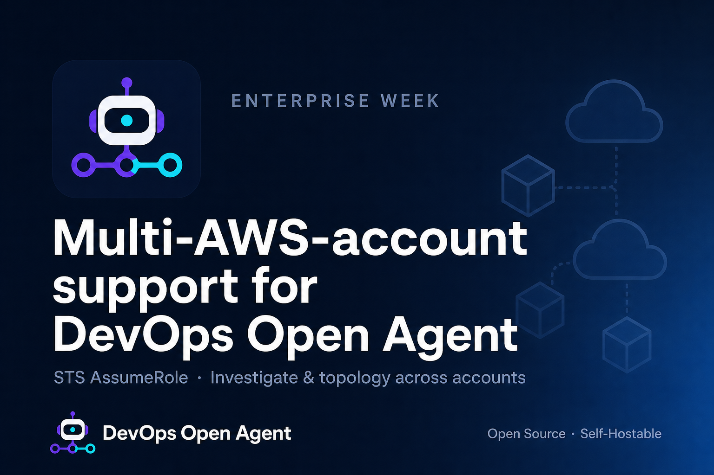
</p>

### What you get

| Capability | Behavior |
|------------|----------|
| **Account picker** | Hub identity plus every enabled AssumeRole account for the signed-in user |
| **Investigate** | EC2 / Lambda / S3 / VPC / SG / LB / CloudWatch / CloudTrail / Config run in the **selected** account |
| **Topology** | Same assumed session as investigate |
| **Hard-fail** | Unknown account IDs do **not** silently fall back to the hub account |
| **Secrets** | External ID is stored per user and returned masked; never logged in full |

Cloud Cost Detector multi-account support is deferred to a later phase.

### Configure in the UI

**Integrations → AWS Accounts** (`/integrations/aws`):

| Setting | Description |
|---------|-------------|
| **Enable** | Include configured accounts in the AWS agent account picker |
| **Account ID** | 12-digit target (member) account |
| **Role ARN** | IAM role in the target account (account ID in the ARN must match) |
| **External ID** | Optional shared secret for the trust policy; masked after save |
| **Default region** | Preferred region for AssumeRole and discovery |
| **Test connection** | Validates hub credentials can assume the role and that the assumed identity matches the account ID |

### How it works

1. Hub session is created from the host credential chain (`AWS_PROFILE`, env keys, or instance role).
2. `GET /api/v1/aws/accounts` returns the hub caller identity plus the current user’s enabled AssumeRole accounts.
3. Investigate / topology resolve credentials:
   - Selected account **is** the hub → use the hub session
   - Selected account **has** a configured role → `sts:AssumeRole` → temporary session bound to that account
   - Otherwise → **hard-fail** with a clear error (configure the account under Integrations)
4. All AWS API calls for that investigation use the resolved session.

### IAM requirements

**Hub identity** (profile / instance role that runs DevOps Open Agent):

```json
{
  "Effect": "Allow",
  "Action": "sts:AssumeRole",
  "Resource": "arn:aws:iam::TARGET_ACCOUNT_ID:role/YourInvestigationRole"
}
```

**Target role trust policy** (in each member account):

```json
{
  "Version": "2012-10-17",
  "Statement": [
    {
      "Effect": "Allow",
      "Principal": {
        "AWS": "arn:aws:iam::HUB_ACCOUNT_ID:root"
      },
      "Action": "sts:AssumeRole",
      "Condition": {
        "StringEquals": {
          "sts:ExternalId": "optional-external-id"
        }
      }
    }
  ]
}
```

Omit the `Condition` block if you are not using an external ID. Prefer a specific hub role ARN as `Principal` instead of account root in production.

**Target role permissions:** read-only investigatory access for the services you use (EC2, Lambda, S3, VPC, ELB, Auto Scaling, CloudWatch, CloudTrail, Config, STS `GetCallerIdentity`). Avoid admin/`OrganizationAccountAccessRole` in production; use a least-privilege investigation role.

### API (authenticated)

| Method | Endpoint | Purpose |
|--------|----------|---------|
| `GET` | `/api/v1/integrations/aws` | Load current user’s AWS account mappings (secrets masked) |
| `PUT` | `/api/v1/integrations/aws` | Create/update mappings |
| `POST` | `/api/v1/integrations/aws/test` | AssumeRole smoke test for one account |
| `GET` | `/api/v1/aws/accounts` | Hub + configured accounts for the investigate picker |

### Quick validation

1. Configure at least one member account under **Integrations → AWS Accounts** and run **Test connection**.
2. Open **AWS → Investigate** — the account dropdown should list the hub and the member account.
3. Select the member account, run an investigation, and confirm the result account ID / credential source shows the assumed account (not a silent hub fallback).

### Hub credentials in Docker

`docker-compose.yml` mounts `${HOME}/.aws` into the backend container read-only. Set `AWS_PROFILE` / `AWS_DEFAULT_REGION` in `backend/.env` when needed. The hub identity must be able to call `sts:AssumeRole` on every configured target role.

## Performance Debugging

Collect Linux performance signals from remote hosts over **passwordless SSH**, then run shared LLM analysis to identify which processes and PIDs are driving CPU, memory, disk, or network pressure.

**UI:** Performance Debugging → **Debug** (`/performance`)

<p align="center">
  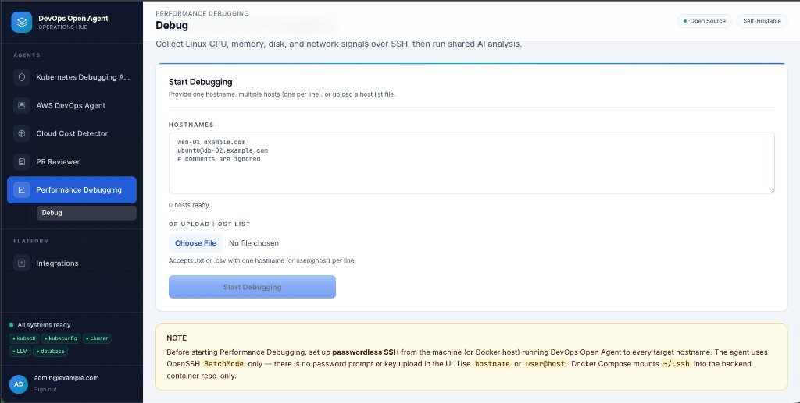
</p>

| Input | Description |
|-------|-------------|
| **Hostnames** | One host per line (`hostname` or `user@host`); `#` comments ignored |
| **Host list file** | Upload a `.txt` or `.csv` with one hostname per line (parsed in the browser) |
| **Start Debugging** | Starts an async job: SSH collect → AI analysis per host → overall summary |

**What gets collected (per host)**

- Uptime / load and CPU count
- Memory (`free`) and disk usage (`df`)
- Top CPU and memory processes (`ps`)
- Network summary (`ss -s`) and pressure stall info when available

**Requirements**

- Passwordless SSH from the machine (or Docker host) running DevOps Open Agent to every target
- OpenSSH `BatchMode` only — no password prompt or key upload in the UI
- Docker Compose mounts `${HOME}/.ssh` into the backend container read-only

**API** (authenticated):

| Method | Endpoint |
|--------|----------|
| `POST` | `/api/v1/performance/debug` |
| `GET` | `/api/v1/performance/debug/{id}/status` |
| `GET` | `/api/v1/performance/debug/{id}` |

Remediation suggestions are **advice only** — the agent does not run `kill`, `sysctl`, or other changes on your hosts.

## Security Scanning (Trivy)

Scan **container images** and **Kubernetes clusters** for vulnerabilities and misconfigurations using [Trivy](https://github.com/aquasecurity/trivy), with optional AI analysis to prioritize findings and suggest remediation.

**UI:** Security Scanning → **Scan** (`/security`)

| Scan type | What Trivy checks |
|-----------|-------------------|
| **Container Image** | OS packages, language-specific dependencies, known CVEs |
| **Kubernetes Cluster** | Workload misconfigurations, image vulnerabilities across the cluster |

**Features**

- Severity filter (CRITICAL / HIGH / MEDIUM / LOW / UNKNOWN)
- Sortable vulnerability and misconfiguration tables
- Summary cards showing counts per severity level
- Optional AI analysis: the configured LLM prioritizes findings by exploitability and blast radius, groups related vulnerabilities, and suggests concrete remediation steps
- LLM provider badge on the AI analysis panel

**Requirements**

- Trivy is **bundled in the Docker image** — no separate install needed
- Container image scans pull the image inside the backend container (Docker-in-Docker or socket mount may be needed for private registries)
- Kubernetes cluster scans reuse the same kubeconfig as the Kubernetes Debugging agent

**API** (authenticated):

| Method | Endpoint |
|--------|----------|
| `POST` | `/api/v1/security/scan` |
| `GET` | `/api/v1/security/scan/{id}/status` |
| `GET` | `/api/v1/security/scan/{id}` |

## LLM-as-a-Judge (AI Verification)

Add a **second AI** to verify the primary diagnosis. When enabled, a separate LLM reviews the diagnosis for factual consistency, evidence grounding, command safety, and completeness — then produces an advisory verdict displayed alongside the original diagnosis.

<p align="center">
  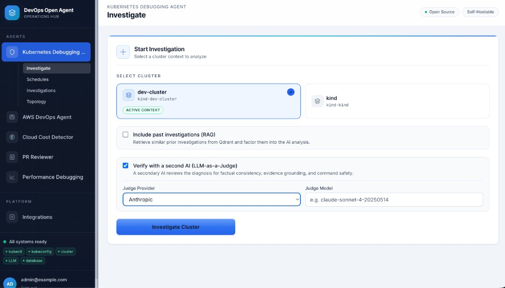
</p>

**How it works**

1. The primary AI completes its diagnosis (root cause, fix, kubectl commands, etc.)
2. A secondary AI receives the diagnosis **and** the raw investigation evidence
3. The judge evaluates five axes: factual consistency, evidence grounding, command safety, completeness, and actionability
4. The verdict (agree / partially agree / disagree) is displayed as a collapsible panel below the diagnosis

**Configuration**

| Method | Where | Description |
|--------|-------|-------------|
| **Per-request (UI)** | Check "Verify with a second AI" on the investigation form | Pick a different provider and model inline — no restart needed |
| **Environment defaults** | `backend/.env` | Set `JUDGE_LLM_PROVIDER` and `JUDGE_*_MODEL` for instance-wide defaults |
| **Same API keys** | Automatic | The judge reuses API keys from your `.env` — only provider and model are separate |

Example: use OpenAI as the primary for diagnosis and Anthropic as the judge for cross-model verification:

```env
LLM_PROVIDER=openai
OPENAI_API_KEY=sk-...
OPENAI_MODEL=gpt-4o

# Judge uses a different model to avoid self-confirmation bias
JUDGE_LLM_PROVIDER=anthropic
ANTHROPIC_API_KEY=sk-ant-...
JUDGE_ANTHROPIC_MODEL=claude-sonnet-4-20250514
```

Or skip the env vars entirely and pick the judge provider/model in the UI each time.

**Judge verdict fields**

| Field | Description |
|-------|-------------|
| **Verdict** | `agree`, `partially_agree`, or `disagree` |
| **Confidence** | 0–100% confidence in the verdict |
| **Reasoning** | Concise paragraph explaining the assessment |
| **Factual issues** | Claims not supported by evidence |
| **Missed evidence** | Signals present in evidence but not referenced |
| **Command safety concerns** | Dangerous or overly broad kubectl commands |
| **Suggested improvements** | Specific ways to improve the diagnosis |

> **Note:** LLM-as-a-Judge is currently available for the **Kubernetes Debugging Agent**. Support for AWS and other agents may follow in future releases.

## Proactive Kubernetes Schedules

Move from **reactive** troubleshooting (run when something breaks) to **proactive** monitoring — schedule recurring Kubernetes investigations with the same AI pipeline used for manual runs.

**UI:** Kubernetes Debugging Agent → **Schedules** (`/schedules`)

| Schedule type | Description |
|---------------|-------------|
| **Every hour** | Runs at a chosen minute past each hour |
| **Every day** | Runs once daily at a set time (UTC) |
| **Every week** | Runs weekly on a chosen day and time (UTC) |
| **Custom cron** | Full 5-field cron expression for advanced use |

**Per schedule you can configure:**

- Target **cluster** (required)
- Optional **namespace** and **focus query**
- **Include AI diagnosis** (recommended)
- Enable / pause / edit / delete from the Schedules page

**What happens on each run**

1. A background job starts the same investigation flow as **Investigate Cluster**
2. Results are saved to **Investigations** (view last run from the schedule card)
3. If Slack, Microsoft Teams, or PagerDuty is enabled, AI recommendations are delivered — **at most once per cooldown window** per user (see [Integrations](#integrations))

**Example:** an hourly schedule at `:00` runs 24 investigations per day, but Slack receives at most **24 alerts** capped to **~1 per hour** — not 24 messages in one hour.

Schedules are stored per user in PostgreSQL and executed by **APScheduler** inside the backend process. Restart the backend after changing `backend/.env` or deploying updates.

**API** (authenticated):

| Method | Endpoint |
|--------|----------|
| `GET` | `/api/v1/kubernetes/schedules` |
| `POST` | `/api/v1/kubernetes/schedules` |
| `PUT` | `/api/v1/kubernetes/schedules/{id}` |
| `DELETE` | `/api/v1/kubernetes/schedules/{id}` |

> **Note:** Proactive schedules are available for the **Kubernetes Debugging Agent** today. AWS, Cloud Cost, and PR Reviewer scheduling may follow in future releases.

## AWS Lambda & S3

The AWS DevOps Agent includes **focused investigations** for **Lambda** and **S3** — discovery, evidence, topology, and AI diagnosis scoped to the service you select (without pulling unrelated EC2 noise into a Lambda timeout investigation).


| Issue type (UI) | What is investigated |
|-----------------|----------------------|
| **Lambda** | Functions, configuration, timeouts, CloudWatch invocation metrics, log patterns (e.g. `Status: timeout`) |
| **S3** | Buckets, encryption, versioning, public access block, bucket policy posture |
| **Full scan** | EC2, Lambda, S3, VPC, security groups, load balancers, and observability |

**Lambda highlights**

- Detects misconfigured timeouts and invocation failures from CloudWatch
- Parses Lambda logs for timeout and error signals
- AI root cause analysis focused on function configuration and runtime evidence

**S3 highlights**

- Bucket-level security and compliance checks
- Public access and encryption posture in investigation findings
- AI recommendations for hardening misconfigured buckets

In the UI: **AWS DevOps Agent → Investigate** → choose **Lambda** or **S3** as the troubleshooting category, then run with **AI diagnosis** enabled.

Regenerate the AWS services diagram: `python3 scripts/build_aws_services_diagram.py`

## Architecture

Application request flow: the browser talks to the Next.js frontend, which calls the FastAPI backend. The API routes requests to agent modules (Kubernetes, AWS, Cloud Cost, PR Reviewer, Performance Debugging, Security Scanning), each using a shared AI layer and persisting results to SQLite or PostgreSQL. Kubernetes investigations can optionally run **LLM-as-a-Judge** verification using a separate provider/model. **Proactive schedules** trigger Kubernetes investigations via APScheduler; completed AI recommendations can flow to **Slack**, **Microsoft Teams**, and **PagerDuty** with configurable per-user cooldowns.

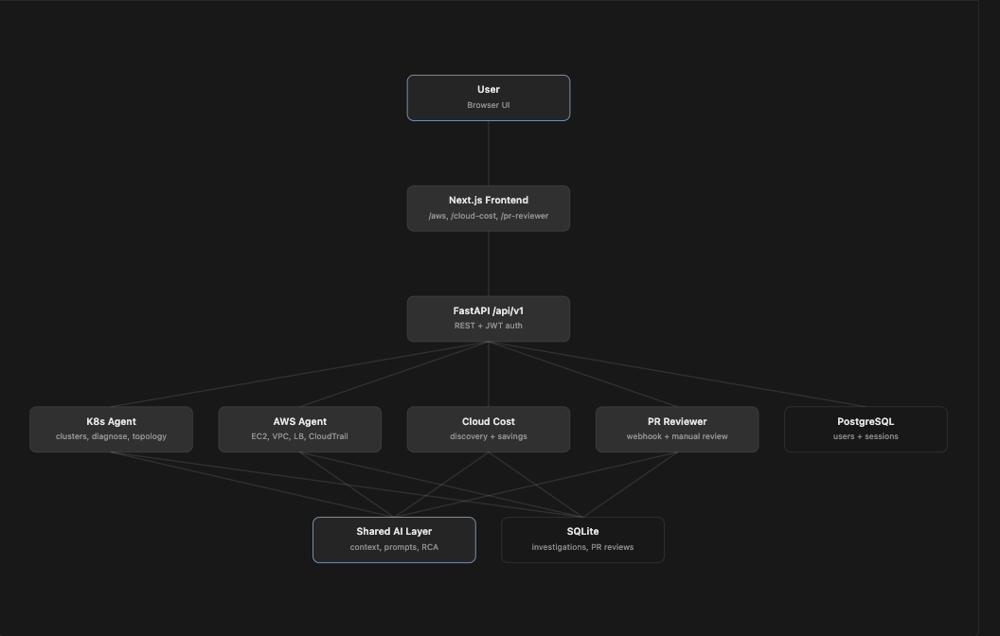

For full platform diagrams and module internals, see [docs/ARCHITECTURE.md](docs/ARCHITECTURE.md).

## Product Tour

Screenshots from the platform across the agent modules.

### 1. DevOps Open Agent

Redesigned **Operations Hub** UI with sidebar navigation across agents, **Usage**, **Audit**, integrations, and system status. Select a cluster, optionally include past investigations via **Qdrant RAG** or enable **LLM-as-a-Judge**, and start a Kubernetes investigation.

<p align="center">
  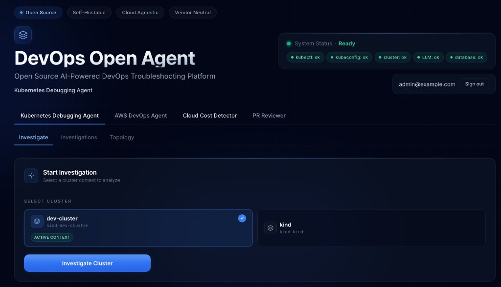
</p>

### 2. Kubernetes Investigation

Live investigation progress across discovery, pods, logs, events, deployments, networking, topology, and AI diagnosis.

<p align="center">
  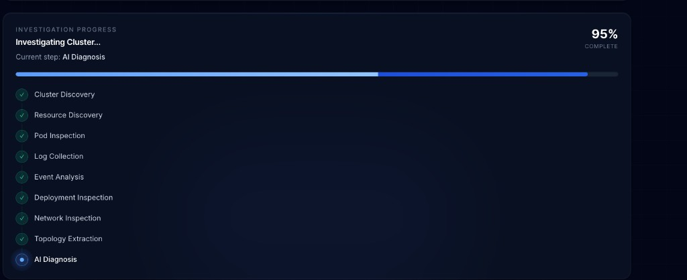
</p>

### 3. Kubernetes AI Diagnosis

AI root cause analysis with confidence score, evidence, and a clear summary of the issue.

<p align="center">
  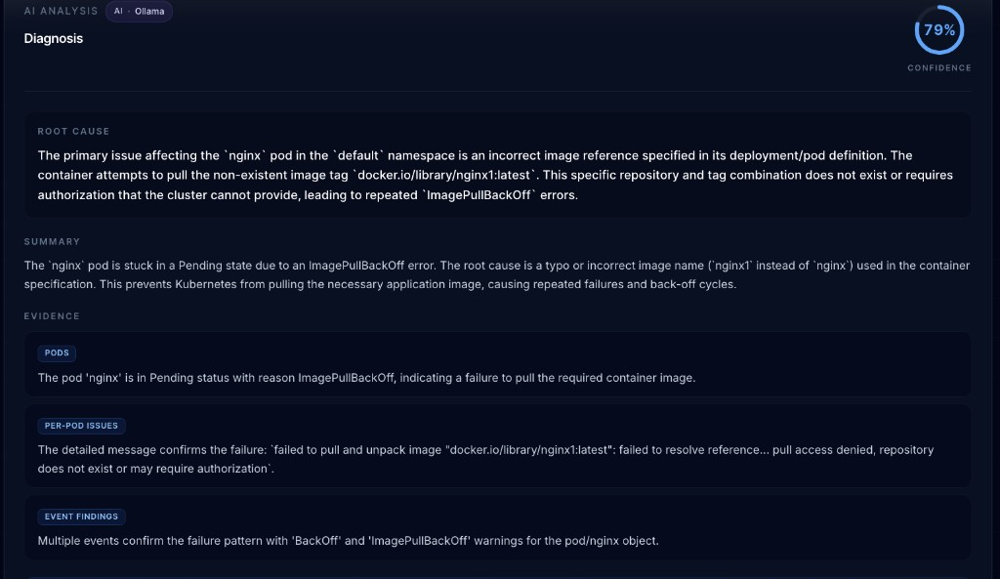
</p>

### 4. Recent Investigation History

Unified history showing root cause, agent, cluster, status, confidence, and timestamps.

<p align="center">
  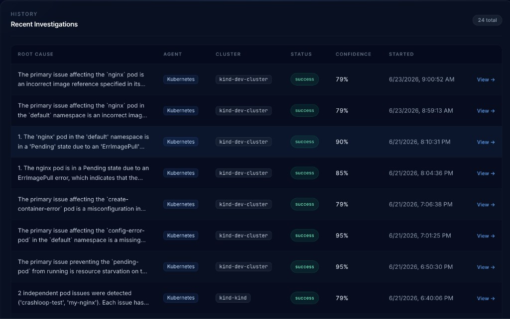
</p>

### 5. Kubernetes Cluster Topology

Namespace-grouped resource map of services, deployments, replica sets, and pods.

<p align="center">
  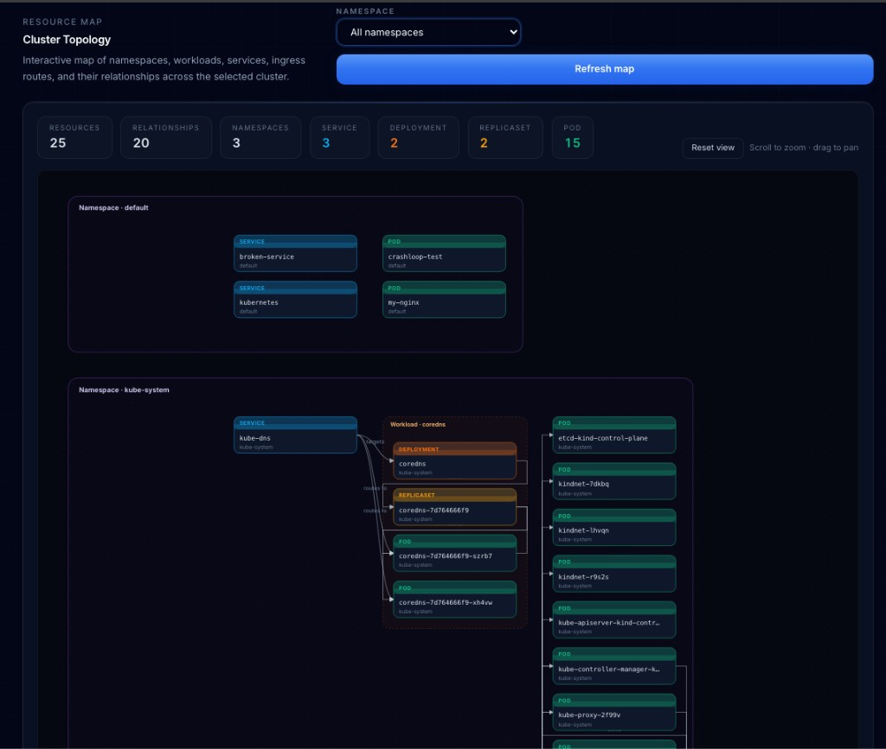
</p>

### 6. AWS DevOps Agent

Choose AWS account, region, and troubleshooting category such as full scan, security, EC2, **Lambda**, **S3**, or network. See [AWS Lambda & S3](#aws-lambda--s3) for focused investigation details.

<p align="center">
  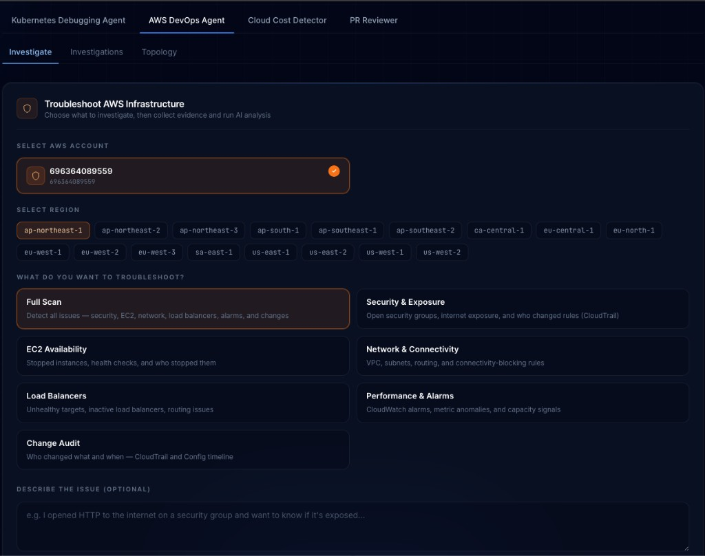
</p>

**Supported AWS services**

| Service | What the agent discovers |
|---------|--------------------------|
| **EC2** | Instances, EBS volumes, state, tags |
| **Lambda** | Functions, timeouts, CloudWatch invocation metrics |
| **S3** | Buckets, encryption, versioning, public access |
| **VPC** | Subnets, route tables, gateways |
| **Security Groups** | Ingress/egress rules, internet exposure |
| **Load Balancers** | ALB/NLB, target groups, health |
| **Auto Scaling** | ASG capacity and instance membership |
| **CloudWatch** | Alarms, Lambda metrics, evidence window |
| **CloudTrail** | API changes, stop/start attribution |

### 7. AWS Investigation

AWS investigation pipeline covering EC2, **Lambda**, **S3**, network, security groups, load balancers, and observability — with focused modes per issue type.

<p align="center">
  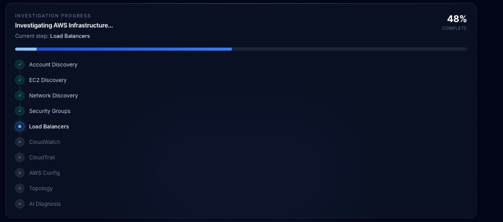
</p>

### 8. AWS Investigation History

AWS investigation history with account, region, status, confidence, and root cause summaries.

<p align="center">
  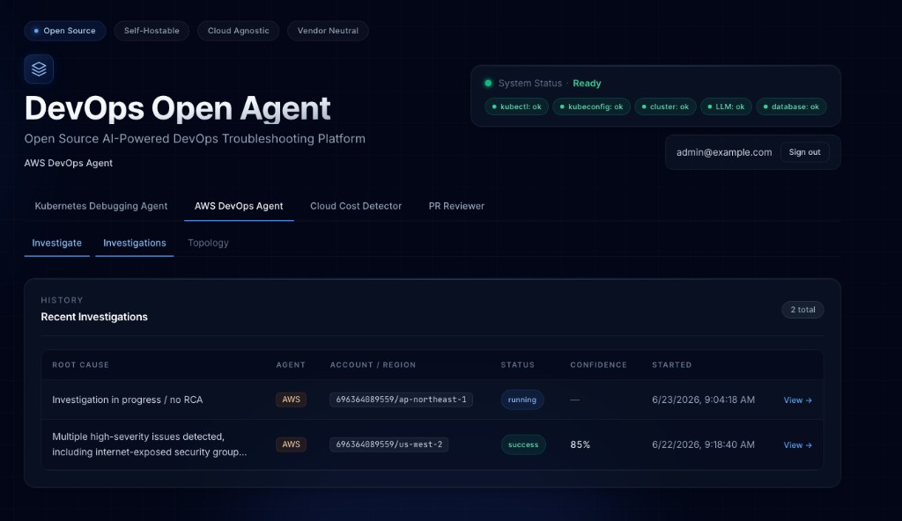
</p>

### 9. AWS AI Analysis

AI diagnosis for exposed security groups, stopped instances, and suggested fixes with CLI examples.

<p align="center">
  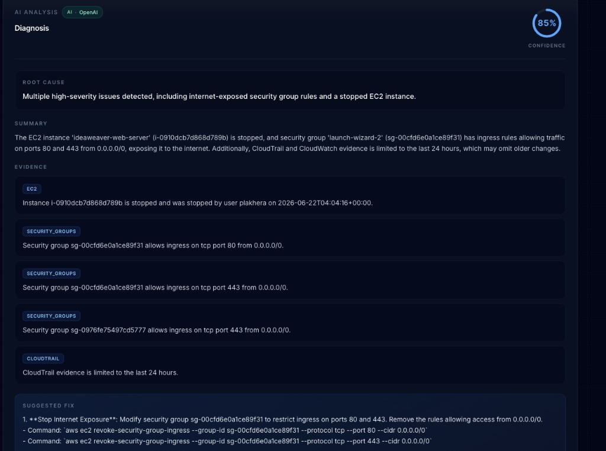
</p>

### 10. AWS Topology

Interactive AWS topology map for VPCs, subnets, EC2, EBS, security groups, and gateways.

<p align="center">
  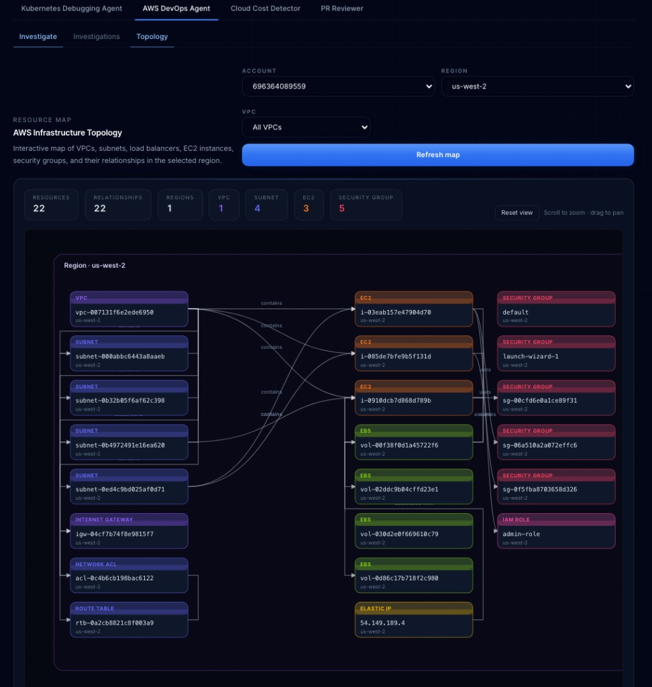
</p>

### 11. Cloud Cost Detector

Multi-step AWS cost optimization workflow from discovery through AI cost analysis.

<p align="center">
  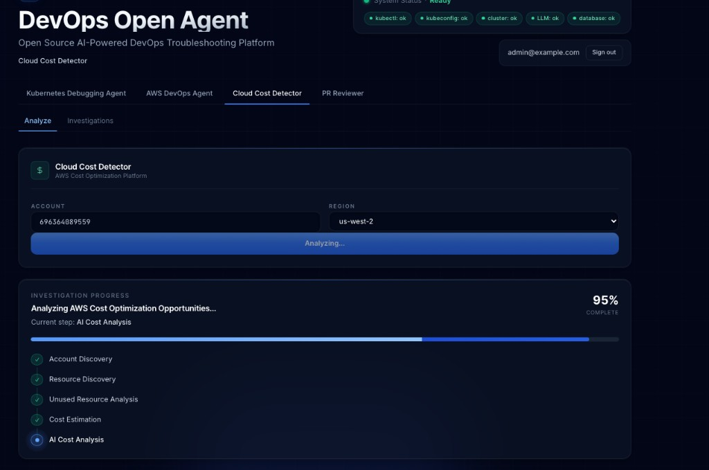
</p>

### 12. Cloud Investigation Details

Savings estimates, Cost Explorer context, AI optimization report, and prioritized findings.

<p align="center">
  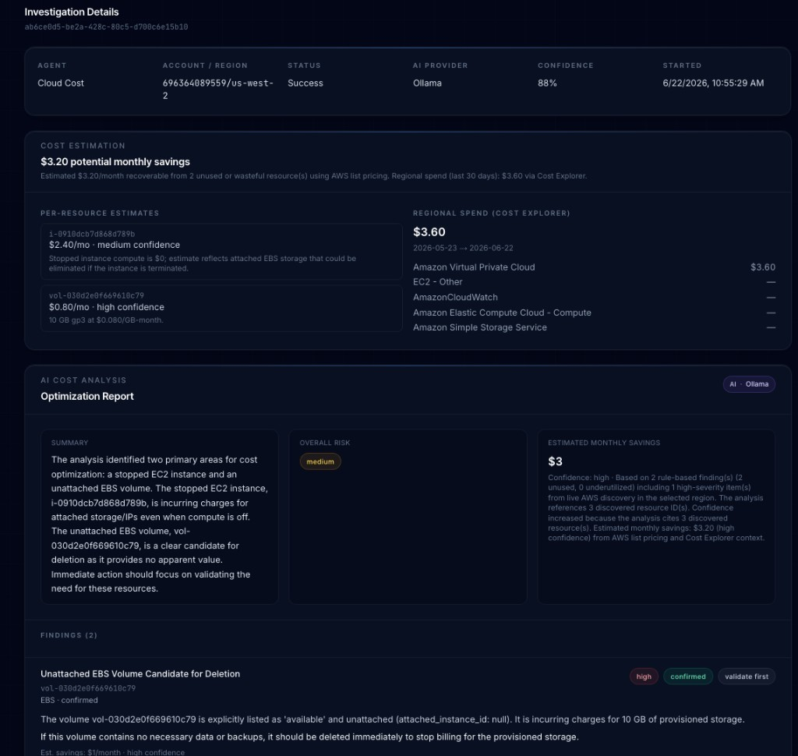
</p>

### 13. GitHub PR Reviewer

Configure GitHub webhooks and tokens, or trigger a manual DevOps PR review.

<p align="center">
  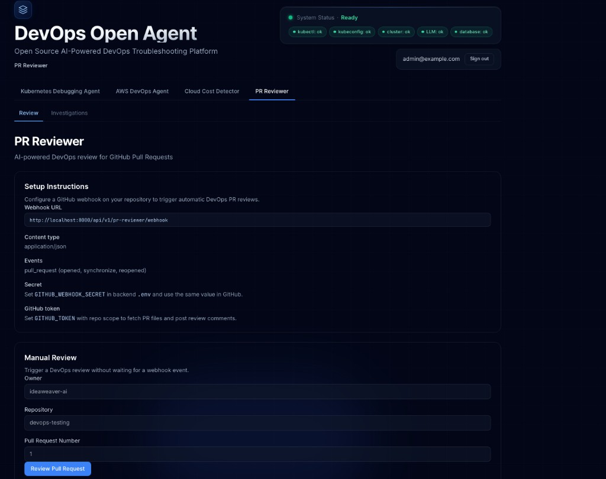
</p>

### 14. PR Review AI Analysis

Completed AI DevOps PR review with risk rating and structured security and reliability findings.

<p align="center">
  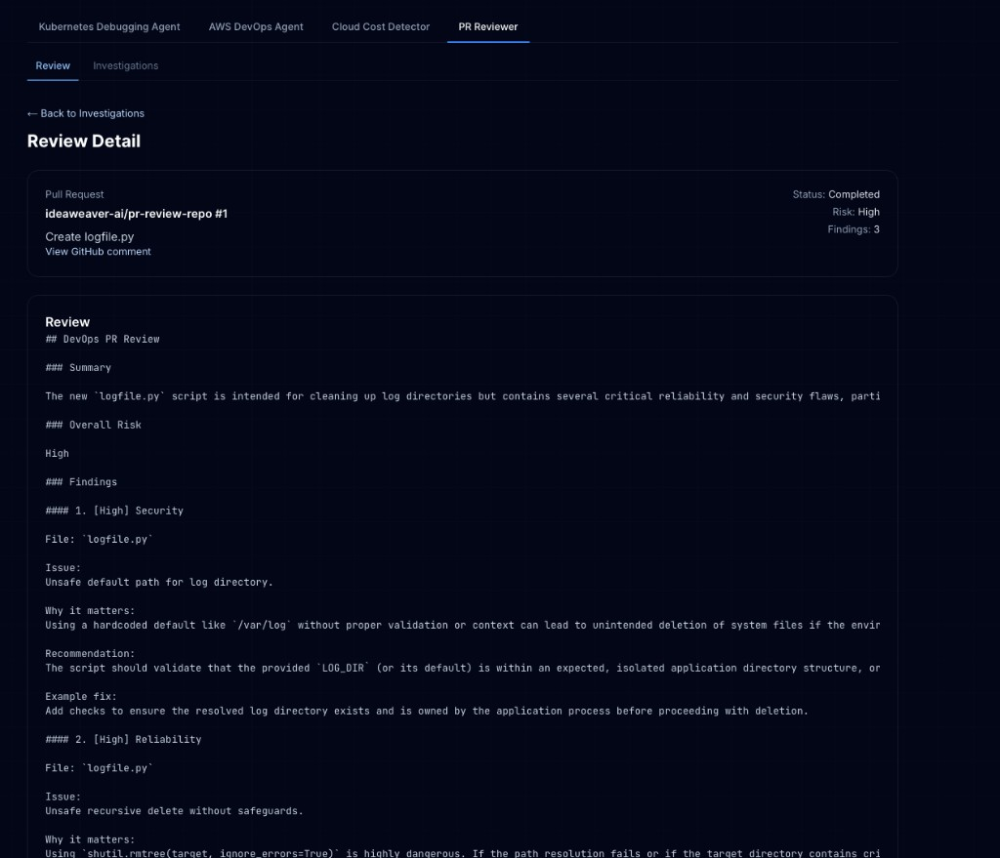
</p>

### 15. Performance Debugging

Enter hostnames (or upload a host list), collect Linux metrics over passwordless SSH, and run shared AI performance analysis. See [Performance Debugging](#performance-debugging).

<p align="center">
  
</p>

### 16. Security Scanning

Scan container images and Kubernetes clusters for vulnerabilities and misconfigurations with Trivy. View severity summary cards, sortable findings tables, and AI-prioritized remediation. See [Security Scanning](#security-scanning-trivy).

<p align="center">
  
</p>

### 17. LLM-as-a-Judge

Enable a second AI to verify the primary diagnosis. Pick a different provider and model inline — the judge evaluates factual consistency, evidence grounding, command safety, and completeness. See [LLM-as-a-Judge](#llm-as-a-judge-ai-verification).

<p align="center">
  
</p>

You can also [download the product tour as a PDF](docs/devops-open-agent-product-tour.pdf).

## New host checklist

Use this flow when provisioning a **fresh Linux or EC2 host**. For local development on your laptop, see [Quick Install](#quick-install) instead.

Nothing in the repository is tied to a specific IP, AWS account, or personal credentials. You configure those per host.

### 1. Clone and enter the project

```bash
git clone https://github.com/ideaweaver-ai/devops-open-agent.git
cd devops-open-agent
```

### 2. Set public URLs (required for remote access)

Create `.env` in the **project root** (next to `docker-compose.yml`), not in `backend/`:

```bash
cp .env.compose.example .env
```

Edit with your public IP or domain:

```env
PUBLIC_API_BASE_URL=http://<YOUR_IP_OR_DOMAIN>:8000
PUBLIC_APP_URL=http://<YOUR_IP_OR_DOMAIN>:3000
```

Open security group / firewall ports **3000** (UI) and **8000** (API) for your client IP.

### 3. Configure backend secrets

```bash
cp backend/.env.example backend/.env
```

Set at minimum:

```env
JWT_SECRET=<random-secret>
DEFAULT_ADMIN_PASSWORD=<your-secure-password>
AWS_DEFAULT_REGION=<your-region>
LLM_PROVIDER=ollama
OLLAMA_BASE_URL=http://host.docker.internal:11434
OLLAMA_MODEL=gemma4:e4b
```

Important:

- **Do not** add a blank `AWS_PROFILE=` line — omit it entirely or set a real profile name.
- **Do not** set `KUBECONFIG_PATH=/root/.kube/config` — Docker mounts kubeconfig at `/home/kube/.kube/config` inside the container.
- Add `GITHUB_TOKEN` only if using PR Reviewer.

### 4. Configure AWS on the host

```bash
aws configure
```

Credentials are mounted into the container at `/root/.aws/`. Verify after install:

```bash
docker compose exec backend python -c "import boto3; print(boto3.client('sts').get_caller_identity())"
```

Alternatively, attach an **IAM instance role** to the EC2 instance and skip `aws configure`.

### 5. Install and start

```bash
chmod +x install.sh
./install.sh --admin-pass '<your-secure-password>'
```

Or manually:

```bash
docker compose up -d --build
```

### 6. Verify the deployment

```bash
docker compose ps
docker compose exec frontend printenv NEXT_PUBLIC_API_BASE_URL
curl -s http://127.0.0.1:8000/health
```

Sign in at `http://<YOUR_IP_OR_DOMAIN>:3000/login` with username **`admin`**.

### 7. Optional — Kubernetes (Kind)

```bash
kind create cluster --name devops-agent --config deploy/kind-devops-agent.yaml
kubectl config use-context kind-devops-agent
docker compose up -d --force-recreate backend
docker compose exec backend kubectl --kubeconfig data/kubeconfig.docker.yaml get nodes
```

See [Kubernetes on Docker / AWS](#kubernetes-on-docker--aws) if cluster checks fail.

### Per-host configuration reference

| Item | Where | Notes |
|------|--------|--------|
| Public URLs | Root `.env` | `PUBLIC_API_BASE_URL`, `PUBLIC_APP_URL` |
| Secrets / LLM / AWS region | `backend/.env` | Never commit this file |
| AWS credentials | Host `~/.aws/` or IAM role | Mounted read-only into backend |
| Kubeconfig | Host `~/.kube/` | Mounted at `/home/kube/.kube/` in container |
| Admin login | Seeded on first start | Default username `admin` |

### Troubleshooting on a new host

| Issue | Section |
|-------|---------|
| Login fails from browser | [Remote / AWS deployment](#remote--aws-deployment) |
| `config profile () could not be found` | [AWS on EC2 / Docker](#aws-on-ec2--docker) |
| Kubernetes cluster missing in UI | [Kubernetes on Docker / AWS](#kubernetes-on-docker--aws) |

## Manual Setup

```bash
cp backend/.env.example backend/.env
# Edit backend/.env with your secrets and provider settings
docker compose up -d --build
```

### URLs

| URL | Description |
|-----|-------------|
| http://<your_ip>:3000 | Web UI |
| http://<your_ip>:8000/health | Health check |
| http://<your_ip>:8000/docs | OpenAPI docs |

## Configuration

All backend settings live in `backend/.env` (gitignored). See `backend/.env.example` for the full list.

Common settings:

```env
LLM_PROVIDER=ollama
OLLAMA_BASE_URL=http://host.docker.internal:11434
OLLAMA_MODEL=gemma4:e4b

# OpenRouter (optional — 100+ models)
# LLM_PROVIDER=openrouter
# OPENROUTER_API_KEY=sk-or-...
# OPENROUTER_MODEL=openai/gpt-4o-mini

# Google Gemini (optional)
# LLM_PROVIDER=gemini
# GEMINI_API_KEY=
# GEMINI_MODEL=gemini-2.0-flash

GITHUB_TOKEN=
GITHUB_WEBHOOK_SECRET=

# Slack notifications (optional — see Integrations)
# SLACK_INSTANCE_WEBHOOK_URL=https://hooks.slack.com/services/...
# SLACK_BOT_TOKEN=xoxb-...
# SLACK_NOTIFICATION_COOLDOWN_MINUTES=60

# PagerDuty notifications (optional — see Integrations)
# PAGERDUTY_INSTANCE_ROUTING_KEY=
# PAGERDUTY_NOTIFICATION_COOLDOWN_MINUTES=60

# Microsoft Teams notifications (optional — see Integrations)
# TEAMS_INSTANCE_WEBHOOK_URL=https://outlook.office.com/webhook/...
# TEAMS_NOTIFICATION_COOLDOWN_MINUTES=60

# MCP server (optional — see Integrations)
# MCP_INSTANCE_SERVER_URL=
# MCP_INSTANCE_API_KEY=
# MCP_ALLOWED_SERVER_URLS=https://api.githubcopilot.com/mcp/,api.githubcopilot.com

# LLM-as-a-Judge (optional — uses a second AI to verify the primary diagnosis)
# JUDGE_LLM_PROVIDER=anthropic
# JUDGE_ANTHROPIC_MODEL=claude-sonnet-4-20250514

# PUBLIC_APP_URL=http://localhost:3000

DEFAULT_ADMIN_EMAIL=admin
DEFAULT_ADMIN_PASSWORD=admin123
JWT_SECRET=change-me
```

For PR Reviewer webhooks, point GitHub to:

```text
http://<your-host>:8000/api/v1/pr-reviewer/webhook
```

Use a tunnel (ngrok, Cloudflare Tunnel) for public GitHub delivery.

## Remote / AWS deployment

If you followed the [New host checklist](#new-host-checklist), most of this is already done. Use this section when login or API calls fail from a remote browser.

The browser must call the **public backend URL**, not `localhost`.

**Symptom:** Login shows *"Unable to sign in. Please try again."* and:

```bash
docker compose exec frontend printenv NEXT_PUBLIC_API_BASE_URL
# http://localhost:8000   ← wrong for remote browsers
```

**Fix:** Ensure root `.env` exists (see [New host checklist](#new-host-checklist)):

```bash
cp .env.compose.example .env
```

Edit with your public IP or domain:

```env
PUBLIC_API_BASE_URL=http://<YOUR_IP_OR_DOMAIN>:8000
PUBLIC_APP_URL=http://<YOUR_IP_OR_DOMAIN>:3000
```

Rebuild and restart (frontend bakes in the API URL at build time):

```bash
docker compose build frontend
docker compose up -d --force-recreate backend frontend
```

Verify:

```bash
docker compose exec frontend printenv NEXT_PUBLIC_API_BASE_URL
curl -s http://127.0.0.1:8000/health
```

**Security group:** Allow inbound **TCP 3000** and **8000** from your client IP (browser needs both).

**Test login from the server:**

```bash
curl -s -X POST http://127.0.0.1:8000/api/v1/auth/login \
  -H "Content-Type: application/json" \
  -d '{"email":"admin","password":"admin123"}'
```

## Kubernetes on Docker / AWS

**Do not set** `KUBECONFIG_PATH=/root/.kube/config` in `backend/.env` when using Docker Compose.

| Location | Path |
|----------|------|
| On the EC2 host (as root) | `/root/.kube/config` |
| Inside the backend container | `/home/kube/.kube/config` |

`/home/kube/` exists **inside the backend container only** — not on the EC2 host. Check the mount with:

```bash
docker compose exec backend ls -la /home/kube/.kube/config
```

Docker Compose mounts `${HOME}/.kube` → `/home/kube/.kube`. Leave `KUBECONFIG_PATH` empty in `backend/.env`.

### Why `kubectl` fails inside the container

Kind writes the API server as `https://127.0.0.1:<port>`. Inside a container, `127.0.0.1` is the container itself, not your EC2 host — so this fails:

```bash
docker compose exec backend kubectl get nodes
# dial tcp 127.0.0.1:34253: connect: connection refused
```

The app rewrites localhost to `host.docker.internal` automatically. Kind must also listen on `0.0.0.0`, not only `127.0.0.1`.

### Setup Kind on Ubuntu EC2 (recommended)

```bash
cd ~/devops-open-agent
git pull origin main

# Recreate cluster so the API is reachable from Docker
kind delete cluster --name devops-agent 2>/dev/null || true
kind create cluster --name devops-agent --config deploy/kind-devops-agent.yaml

kubectl config use-context kind-devops-agent
kubectl get nodes
```

Verify inside the backend container:

```bash
docker compose up -d --force-recreate backend

# Mount + rewritten kubeconfig
docker compose exec backend ls -la /home/kube/.kube/config
docker compose exec backend python -c "
from app.kubernetes.kubeconfig_resolver import prepare_kubeconfig
print(prepare_kubeconfig(api_host_rewrite='host.docker.internal'))
"

# Use the rewritten config (what the app uses)
docker compose exec backend kubectl --kubeconfig data/kubeconfig.docker.yaml get nodes
```

If the last command works, refresh the UI — **kubeconfig** and **cluster** should turn green.

### Troubleshooting

| Symptom | Fix |
|---------|-----|
| `ls: cannot access '/home/kube/'` on EC2 host | Normal — run checks with `docker compose exec backend ...` |
| `current-context is not set` | `kubectl config use-context kind-devops-agent` on the host |
| `127.0.0.1: connect refused` in container | Recreate Kind with `deploy/kind-devops-agent.yaml` |
| `kubeconfig: missing` in UI | Clear `KUBECONFIG_PATH` in `backend/.env`, ensure `/root/.kube/config` exists on host |

Remove any wrong path from `backend/.env`:

```env
KUBECONFIG_PATH=
```

## AWS on EC2 / Docker

**Error:** `The config profile () could not be found`

This happens when `backend/.env` contains an empty line:

```env
AWS_PROFILE=
```

Docker injects that as a blank profile name. **Remove that line** from `backend/.env` (or set a real profile, e.g. `AWS_PROFILE=default`).

**Recommended on EC2:** attach an **IAM instance role** with AWS read permissions and do not set `AWS_PROFILE` at all. Boto3 will use the instance role automatically.

**Alternative:** mount host credentials (already configured in `docker-compose.yml`):

```bash
aws configure   # on the EC2 host
docker compose exec backend ls -la /root/.aws/
docker compose exec backend python -c "import boto3; print(boto3.client('sts').get_caller_identity())"
```

Then restart:

```bash
docker compose up -d --force-recreate backend
```

Set region in `backend/.env` if needed:

```env
AWS_DEFAULT_REGION=us-west-2
```

## Project Structure

```text
open-devops-agent/
├── backend/              # FastAPI application
│   └── app/
│       ├── modules/      # Agent modules (aws, cloud_cost, pr_reviewer, security, ...)
│       ├── ai/           # Shared LLM providers + LLM-as-a-Judge
│       ├── notifications/# Slack, Teams & PagerDuty delivery + cooldown
│       ├── services/     # Investigation jobs, schedules, integration settings
│       └── storage/      # SQLite history stores
├── frontend/             # Next.js UI (Investigate, Schedules, Integrations, …)
├── docker-compose.yml
├── install.sh            # macOS/Linux installer
├── docs/                 # Additional documentation
└── prompts/              # Agent prompt specs
```

## Development

**Backend:**

```bash
cd backend
python3 -m venv .venv
source .venv/bin/activate
pip install -r requirements.txt
cp .env.example .env
uvicorn app.main:app --reload --port 8000
```

**Frontend:**

```bash
cd frontend
npm install
npm run dev
```

## Publishing to GitHub

Only source and configuration templates should be committed. Secrets and build artifacts are excluded via `.gitignore`.

**Safe to commit:**

- `backend/app/`, `backend/requirements.txt`, `backend/Dockerfile`, `backend/.env.example`
- `frontend/` source (not `node_modules/` or `.next/`)
- `docker-compose.yml`, `install.sh`, `README.md`, `docs/`, `prompts/`, `tests/`

**Never commit:**

- `backend/.env` (API keys, tokens, passwords)
- `node_modules/`, `.next/`, `.venv/`
- `data/` and local SQLite databases
- `.cursor/` and IDE-specific files

Initialize and push:

```bash
git init
git add .
git status   # verify no secrets or build artifacts are staged
git commit -m "Initial commit: DevOps Open Agent platform"
git branch -M main
git remote add origin https://github.com/<org>/<repo>.git
git push -u origin main
```

## Useful Commands

```bash
docker compose logs -f
docker compose down
docker compose up -d --build
docker compose exec backend python -c "from app.core.config import get_settings; print(get_settings().llm_provider)"
```

## License

Open source — contributions welcome.
