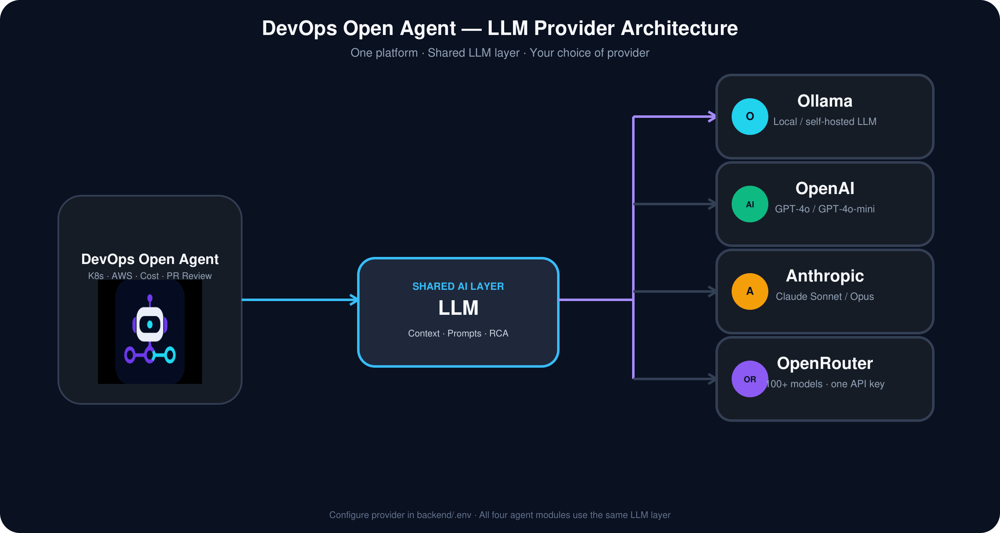

<p align="center">
  
</p>

# DevOps Open Agent

**DevOps Open Agent** is an open-source, self-hostable, AI-powered DevOps troubleshooting platform. It helps DevOps engineers, SREs, and platform teams investigate infrastructure issues, optimize cloud costs, and review pull requests with DevOps-focused AI guidance — reactively on demand or **proactively on a schedule** — then deliver recommendations to **Slack** and **PagerDuty** without alert fatigue.

## Modules

| Module | Description |
|--------|-------------|
| **Kubernetes Debugging Agent** | Investigate clusters, workloads, networking, and topology — **on demand or on a schedule** |
| **AWS DevOps Agent** | Troubleshoot AWS infrastructure — EC2, **Lambda**, **S3**, VPC, load balancers, CloudWatch, and more |
| **Cloud Cost Detector** | Find unused and underutilized AWS resources |
| **PR Reviewer** | AI DevOps review for GitHub pull requests |
| **Integrations** | **Slack** and **PagerDuty** — post AI recommendations to your channel or trigger on-call incidents |

## Demo Video

Watch a full walkthrough of DevOps Open Agent — how the platform works across all four agents, AI root cause analysis, and Slack / PagerDuty integrations.

<p align="center">
  <a href="https://youtu.be/3VT8MeSLt5s">
    
  </a>
</p>

**[▶ Watch on YouTube](https://youtu.be/3VT8MeSLt5s)**

The demo covers:

1. **Platform overview** — one UI for Kubernetes, AWS, cloud cost, and PR review workflows  
2. **Live investigations** — discovery, evidence collection, topology, and progress tracking  
3. **AI diagnosis** — root cause, suggested fixes, confidence scores, and validation steps  
4. **Integrations** — Slack notifications and PagerDuty incidents from AI recommendations  
5. **Proactive schedules** — recurring Kubernetes investigations with AI diagnosis  
6. **Self-hosted setup** — running locally with Docker Compose and your choice of LLM provider  

## Tech Stack

- **Backend:** Python 3.12, FastAPI, SQLite, PostgreSQL (auth + schedules), APScheduler, shared LLM providers
- **Frontend:** Next.js 15, TypeScript, Tailwind CSS, TanStack Query
- **Runtime:** Docker Compose

Supported LLM providers: OpenAI, Anthropic, OpenRouter, Ollama — see [LLM Supported](#llm-supported).

## LLM Supported

All four agent modules (Kubernetes, AWS, Cloud Cost, PR Reviewer) use a **shared LLM layer**.  
Configure one provider in `backend/.env` — every investigation, diagnosis, and PR review uses it.



| Provider | `LLM_PROVIDER` | Configure in `backend/.env` |
|----------|--------------|-------------------------------|
| **Ollama** | `ollama` | `OLLAMA_BASE_URL`, `OLLAMA_MODEL` — local / self-hosted |
| **OpenAI** | `openai` | `OPENAI_API_KEY`, `OPENAI_MODEL` |
| **Anthropic** | `anthropic` | `ANTHROPIC_API_KEY`, `ANTHROPIC_MODEL` |
| **OpenRouter** | `openrouter` | `OPENROUTER_API_KEY`, `OPENROUTER_MODEL` |

Example (`backend/.env`):

```env
# Anthropic
LLM_PROVIDER=anthropic
ANTHROPIC_API_KEY=sk-ant-...
ANTHROPIC_MODEL=claude-sonnet-4-6

# OpenRouter (100+ models through one API key)
# LLM_PROVIDER=openrouter
# OPENROUTER_API_KEY=sk-or-...
# OPENROUTER_MODEL=openai/gpt-4o-mini
```

After changing provider settings, restart the backend:

```bash
docker compose up -d --force-recreate backend
```

## Integrations

Deliver AI recommendations from investigations and PR reviews to the tools your team already uses. Configure everything under **Integrations** in the UI (`/integrations/slack` and `/integrations/pagerduty`).


Regenerate the diagram: `python3 scripts/build_integrations_diagram.py`

| Integration | UI path | Best for |
|-------------|---------|----------|
| **Slack** | Integrations → Slack | Team chat alerts, webhooks, channel delivery |
| **PagerDuty** | Integrations → PagerDuty | On-call incidents, Events API v2, enterprise alerting |

Both integrations support:

- Per-user settings stored in PostgreSQL
- Per-agent toggles (Kubernetes, AWS, Cloud Cost, PR Reviewer)
- Configurable alert cooldown to reduce fatigue
- **Send test** button to verify delivery
- Optional instance-level defaults in `backend/.env` (for GitHub webhook events)

### Slack

AI recommendations from investigations and PR reviews can be delivered to your preferred Slack channel (webhook or bot).


Configure per-user settings under **Integrations → Slack** in the UI, or set instance defaults in `backend/.env`:

```env
SLACK_INSTANCE_WEBHOOK_URL=https://hooks.slack.com/services/...
SLACK_BOT_TOKEN=xoxb-...
SLACK_NOTIFICATION_COOLDOWN_MINUTES=60
PUBLIC_APP_URL=http://localhost:3000
```

Regenerate the Slack diagram: `python3 scripts/build_slack_flow_diagram.py`

**What gets posted to Slack**

- Root cause, summary, suggested fix, and validation steps from AI investigations (Kubernetes, AWS, Cloud Cost)
- Final recommendation and risk summary from PR reviews
- Per-user channel or webhook under **Integrations → Slack** in the UI
- Optional per-agent toggles (enable/disable notifications per module)

**Setup options**

| Method | Configure |
|--------|-----------|
| **Incoming webhook** | Paste webhook URL in **Integrations → Slack** (simplest) |
| **Bot channel** | Set `SLACK_BOT_TOKEN` on the server + channel name in the UI |
| **Instance default** | Set `SLACK_INSTANCE_WEBHOOK_URL` in `backend/.env` (fallback for webhooks) |

**Alert fatigue protection**

Slack notifications are rate-limited to **one alert per hour per user** (default). Investigations and scheduled runs still complete and appear in the UI — only the Slack post is suppressed until the cooldown expires. Adjust in `backend/.env`:

```env
SLACK_NOTIFICATION_COOLDOWN_MINUTES=60
```

Set to `0` to disable the cooldown (not recommended for proactive schedules).

**API** (authenticated):

| Method | Endpoint |
|--------|----------|
| `GET` | `/api/v1/integrations/slack` |
| `PUT` | `/api/v1/integrations/slack` |
| `POST` | `/api/v1/integrations/slack/test` |

### PagerDuty

Trigger PagerDuty incidents when AI investigations or PR reviews complete — ideal for on-call workflows and enterprise-grade alerting.

Configure per-user settings under **Integrations → PagerDuty** in the UI, or set an instance routing key in `backend/.env`:

```env
PAGERDUTY_INSTANCE_ROUTING_KEY=
PAGERDUTY_NOTIFICATION_COOLDOWN_MINUTES=60
PUBLIC_APP_URL=http://localhost:3000
```

**What gets sent to PagerDuty**

- **Investigations:** root cause, summary, suggested fix, validation steps, and confidence score in incident `custom_details`
- **PR reviews:** final recommendation, risk level, and findings count
- **Severity mapping:** from AI confidence (investigations) or PR risk rating
- **Dedup keys:** `devops-open-agent:investigation:{id}` / `devops-open-agent:pr:{id}` — avoids duplicate incidents on retries

**Per-user settings (UI)**

| Setting | Description |
|---------|-------------|
| **Enable notifications** | Turn PagerDuty incidents on/off |
| **Routing key** | Events API v2 integration key from your PagerDuty service |
| **Alert cooldown (minutes)** | Minimum minutes between incidents for your account (`0` = no cooldown) |
| **Agent toggles** | Choose which agents trigger PagerDuty |

In PagerDuty: **Services → your service → Integrations → Events API V2** → copy the routing key.

**Alert fatigue protection**

Same pattern as Slack — incidents are rate-limited per user (default **60 minutes**). Investigations still complete; only the PagerDuty trigger is suppressed until cooldown expires. Set per-user cooldown in the UI or instance default via `PAGERDUTY_NOTIFICATION_COOLDOWN_MINUTES`.

**API** (authenticated):

| Method | Endpoint |
|--------|----------|
| `GET` | `/api/v1/integrations/pagerduty` |
| `PUT` | `/api/v1/integrations/pagerduty` |
| `POST` | `/api/v1/integrations/pagerduty/test` |

After changing integration settings in `backend/.env`, restart the backend:

```bash
docker compose up -d --force-recreate backend
```

If you added new integration UI pages, rebuild the frontend as well (Docker bakes routes at build time):

```bash
docker compose build frontend && docker compose up -d --force-recreate frontend
```

## Proactive Kubernetes Schedules

Move from **reactive** troubleshooting (run when something breaks) to **proactive** monitoring — schedule recurring Kubernetes investigations with the same AI pipeline used for manual runs.

**UI:** Kubernetes Debugging Agent → **Schedules** (`/schedules`)

| Schedule type | Description |
|---------------|-------------|
| **Every hour** | Runs at a chosen minute past each hour |
| **Every day** | Runs once daily at a set time (UTC) |
| **Every week** | Runs weekly on a chosen day and time (UTC) |
| **Custom cron** | Full 5-field cron expression for advanced use |

**Per schedule you can configure:**

- Target **cluster** (required)
- Optional **namespace** and **focus query**
- **Include AI diagnosis** (recommended)
- Enable / pause / edit / delete from the Schedules page

**What happens on each run**

1. A background job starts the same investigation flow as **Investigate Cluster**
2. Results are saved to **Investigations** (view last run from the schedule card)
3. If Slack or PagerDuty is enabled, AI recommendations are delivered — **at most once per cooldown window** per user (see [Integrations](#integrations))

**Example:** an hourly schedule at `:00` runs 24 investigations per day, but Slack receives at most **24 alerts** capped to **~1 per hour** — not 24 messages in one hour.

Schedules are stored per user in PostgreSQL and executed by **APScheduler** inside the backend process. Restart the backend after changing `backend/.env` or deploying updates.

**API** (authenticated):

| Method | Endpoint |
|--------|----------|
| `GET` | `/api/v1/kubernetes/schedules` |
| `POST` | `/api/v1/kubernetes/schedules` |
| `PUT` | `/api/v1/kubernetes/schedules/{id}` |
| `DELETE` | `/api/v1/kubernetes/schedules/{id}` |

> **Note:** Proactive schedules are available for the **Kubernetes Debugging Agent** today. AWS, Cloud Cost, and PR Reviewer scheduling may follow in future releases.

## AWS Lambda & S3

The AWS DevOps Agent includes **focused investigations** for **Lambda** and **S3** — discovery, evidence, topology, and AI diagnosis scoped to the service you select (without pulling unrelated EC2 noise into a Lambda timeout investigation).


| Issue type (UI) | What is investigated |
|-----------------|----------------------|
| **Lambda** | Functions, configuration, timeouts, CloudWatch invocation metrics, log patterns (e.g. `Status: timeout`) |
| **S3** | Buckets, encryption, versioning, public access block, bucket policy posture |
| **Full scan** | EC2, Lambda, S3, VPC, security groups, load balancers, and observability |

**Lambda highlights**

- Detects misconfigured timeouts and invocation failures from CloudWatch
- Parses Lambda logs for timeout and error signals
- AI root cause analysis focused on function configuration and runtime evidence

**S3 highlights**

- Bucket-level security and compliance checks
- Public access and encryption posture in investigation findings
- AI recommendations for hardening misconfigured buckets

In the UI: **AWS DevOps Agent → Investigate** → choose **Lambda** or **S3** as the troubleshooting category, then run with **AI diagnosis** enabled.

Regenerate the AWS services diagram: `python3 scripts/build_aws_services_diagram.py`

## Architecture

Application request flow: the browser talks to the Next.js frontend, which calls the FastAPI backend. The API routes requests to agent modules (Kubernetes, AWS, Cloud Cost, PR Reviewer), each using a shared AI layer and persisting results to SQLite or PostgreSQL. **Proactive schedules** trigger Kubernetes investigations via APScheduler; completed AI recommendations can flow to **Slack** and **PagerDuty** with configurable per-user cooldowns.


For full platform diagrams and module internals, see [docs/ARCHITECTURE.md](docs/ARCHITECTURE.md).

## Product Tour

Screenshots from the platform across all four agent modules.

### 1. DevOps Open Agent

Platform home for the Kubernetes Debugging Agent. Select a cluster, check system readiness, and start an investigation.

<p align="center">
  
</p>

### 2. Kubernetes Investigation

Live investigation progress across discovery, pods, logs, events, deployments, networking, topology, and AI diagnosis.

<p align="center">
  
</p>

### 3. Kubernetes AI Diagnosis

AI root cause analysis with confidence score, evidence, and a clear summary of the issue.

<p align="center">
  
</p>

### 4. Recent Investigation History

Unified history showing root cause, agent, cluster, status, confidence, and timestamps.

<p align="center">
  
</p>

### 5. Kubernetes Cluster Topology

Namespace-grouped resource map of services, deployments, replica sets, and pods.

<p align="center">
  
</p>

### 6. AWS DevOps Agent

Choose AWS account, region, and troubleshooting category such as full scan, security, EC2, **Lambda**, **S3**, or network. See [AWS Lambda & S3](#aws-lambda--s3) for focused investigation details.

<p align="center">
  
</p>

**Supported AWS services**

| Service | What the agent discovers |
|---------|--------------------------|
| **EC2** | Instances, EBS volumes, state, tags |
| **Lambda** | Functions, timeouts, CloudWatch invocation metrics |
| **S3** | Buckets, encryption, versioning, public access |
| **VPC** | Subnets, route tables, gateways |
| **Security Groups** | Ingress/egress rules, internet exposure |
| **Load Balancers** | ALB/NLB, target groups, health |
| **Auto Scaling** | ASG capacity and instance membership |
| **CloudWatch** | Alarms, Lambda metrics, evidence window |
| **CloudTrail** | API changes, stop/start attribution |

### 7. AWS Investigation

AWS investigation pipeline covering EC2, **Lambda**, **S3**, network, security groups, load balancers, and observability — with focused modes per issue type.

<p align="center">
  
</p>

### 8. AWS Investigation History

AWS investigation history with account, region, status, confidence, and root cause summaries.

<p align="center">
  
</p>

### 9. AWS AI Analysis

AI diagnosis for exposed security groups, stopped instances, and suggested fixes with CLI examples.

<p align="center">
  
</p>

### 10. AWS Topology

Interactive AWS topology map for VPCs, subnets, EC2, EBS, security groups, and gateways.

<p align="center">
  
</p>

### 11. Cloud Cost Detector

Multi-step AWS cost optimization workflow from discovery through AI cost analysis.

<p align="center">
  
</p>

### 12. Cloud Investigation Details

Savings estimates, Cost Explorer context, AI optimization report, and prioritized findings.

<p align="center">
  
</p>

### 13. GitHub PR Reviewer

Configure GitHub webhooks and tokens, or trigger a manual DevOps PR review.

<p align="center">
  
</p>

### 14. PR Review AI Analysis

Completed AI DevOps PR review with risk rating and structured security and reliability findings.

<p align="center">
  
</p>

You can also [download the product tour as a PDF](docs/devops-open-agent-product-tour.pdf).

## Prerequisites

- macOS or Linux
- [Docker Desktop](https://www.docker.com/products/docker-desktop/) (macOS) or Docker Engine + Compose (Linux)
- Optional: [Ollama](https://ollama.com/) for local AI
- Optional: `~/.kube/config` for Kubernetes investigations
- Optional: `~/.aws/credentials` for AWS and Cloud Cost modules
- Optional: GitHub token for PR Reviewer

### Ubuntu one-line installs

Use these commands on Ubuntu to install common dependencies before running `./install.sh`.

**Docker**

```bash
curl -fsSL https://get.docker.com | sudo sh
```

After install, add your user to the Docker group (log out/in or reboot afterward):

```bash
sudo usermod -aG docker "$USER"
```

**Ollama (local LLM)**

```bash
curl -fsSL https://ollama.com/install.sh | sh
```

Pull a model (example used by default in `backend/.env.example`):

```bash
ollama pull gemma4:e4b
```

**Kind (local Kubernetes cluster)**

```bash
curl -Lo ./kind https://kind.sigs.k8s.io/dl/latest/kind-linux-amd64 && chmod +x ./kind && sudo mv ./kind /usr/local/bin/kind
```

**AWS CLI v2**

```bash
sudo apt update && sudo apt install -y python3 python3-pip curl unzip && curl "https://awscli.amazonaws.com/awscli-exe-linux-$(uname -m).zip" -o awscliv2.zip && unzip -q awscliv2.zip && sudo ./aws/install
```

Configure credentials:

```bash
aws configure
```

**kubectl**

```bash
curl -LO "https://dl.k8s.io/release/$(curl -L -s https://dl.k8s.io/release/stable.txt)/bin/linux/amd64/kubectl" && chmod +x kubectl && sudo mv kubectl /usr/local/bin/
```

> **Note:** The Kind and kubectl commands above target `linux/amd64`. On ARM64 Ubuntu, replace `amd64` with `arm64` in the download URLs.

## New host checklist

Use this flow when provisioning a **fresh Linux or EC2 host**. For local development on your laptop, see [Quick Install](#quick-install) instead.

Nothing in the repository is tied to a specific IP, AWS account, or personal credentials. You configure those per host.

### 1. Clone and enter the project

```bash
git clone https://github.com/ideaweaver-ai/devops-open-agent.git
cd devops-open-agent
```

### 2. Set public URLs (required for remote access)

Create `.env` in the **project root** (next to `docker-compose.yml`), not in `backend/`:

```bash
cp .env.compose.example .env
```

Edit with your public IP or domain:

```env
PUBLIC_API_BASE_URL=http://<YOUR_IP_OR_DOMAIN>:8000
PUBLIC_APP_URL=http://<YOUR_IP_OR_DOMAIN>:3000
```

Open security group / firewall ports **3000** (UI) and **8000** (API) for your client IP.

### 3. Configure backend secrets

```bash
cp backend/.env.example backend/.env
```

Set at minimum:

```env
JWT_SECRET=<random-secret>
DEFAULT_ADMIN_PASSWORD=<your-secure-password>
AWS_DEFAULT_REGION=<your-region>
LLM_PROVIDER=ollama
OLLAMA_BASE_URL=http://host.docker.internal:11434
OLLAMA_MODEL=gemma4:e4b
```

Important:

- **Do not** add a blank `AWS_PROFILE=` line — omit it entirely or set a real profile name.
- **Do not** set `KUBECONFIG_PATH=/root/.kube/config` — Docker mounts kubeconfig at `/home/kube/.kube/config` inside the container.
- Add `GITHUB_TOKEN` only if using PR Reviewer.

### 4. Configure AWS on the host

```bash
aws configure
```

Credentials are mounted into the container at `/root/.aws/`. Verify after install:

```bash
docker compose exec backend python -c "import boto3; print(boto3.client('sts').get_caller_identity())"
```

Alternatively, attach an **IAM instance role** to the EC2 instance and skip `aws configure`.

### 5. Install and start

```bash
chmod +x install.sh
./install.sh --admin-pass '<your-secure-password>'
```

Or manually:

```bash
docker compose up -d --build
```

### 6. Verify the deployment

```bash
docker compose ps
docker compose exec frontend printenv NEXT_PUBLIC_API_BASE_URL
curl -s http://127.0.0.1:8000/health
```

Sign in at `http://<YOUR_IP_OR_DOMAIN>:3000/login` with username **`admin`**.

### 7. Optional — Kubernetes (Kind)

```bash
kind create cluster --name devops-agent --config deploy/kind-devops-agent.yaml
kubectl config use-context kind-devops-agent
docker compose up -d --force-recreate backend
docker compose exec backend kubectl --kubeconfig data/kubeconfig.docker.yaml get nodes
```

See [Kubernetes on Docker / AWS](#kubernetes-on-docker--aws) if cluster checks fail.

### Per-host configuration reference

| Item | Where | Notes |
|------|--------|--------|
| Public URLs | Root `.env` | `PUBLIC_API_BASE_URL`, `PUBLIC_APP_URL` |
| Secrets / LLM / AWS region | `backend/.env` | Never commit this file |
| AWS credentials | Host `~/.aws/` or IAM role | Mounted read-only into backend |
| Kubeconfig | Host `~/.kube/` | Mounted at `/home/kube/.kube/` in container |
| Admin login | Seeded on first start | Default username `admin` |

### Troubleshooting on a new host

| Issue | Section |
|-------|---------|
| Login fails from browser | [Remote / AWS deployment](#remote--aws-deployment) |
| `config profile () could not be found` | [AWS on EC2 / Docker](#aws-on-ec2--docker) |
| Kubernetes cluster missing in UI | [Kubernetes on Docker / AWS](#kubernetes-on-docker--aws) |

## Quick Install

For **local development** (localhost). On a new remote host, use [New host checklist](#new-host-checklist) instead.

```bash
chmod +x install.sh
./install.sh
```

Custom admin password:

```bash
./install.sh --admin-pass 'MySecurePass123'
```

Configure only (no Docker build):

```bash
./install.sh --skip-build
```

The installer will:

1. Verify Docker and Compose
2. Create `backend/.env` from `backend/.env.example` if missing
3. Set default username `admin` and password
4. Generate a random `JWT_SECRET`
5. Build and start all services with Docker Compose

## Default Login

| Field | Value |
|-------|-------|
| Username | `admin` |
| Password | `admin123` (or value passed to `--admin-pass`) |

Sign in at [http://<your ip>:3000/login](http://<your_ip>:3000/login).

Change the password in `backend/.env` before production:

```env
DEFAULT_ADMIN_PASSWORD=your-secure-password
```

Then restart:

```bash
docker compose up -d --force-recreate backend
```

> **Note:** If an older install already created `admin@example.com`, delete the Postgres volume or sign up a new user. Fresh installs use username `admin`.

## Manual Setup

```bash
cp backend/.env.example backend/.env
# Edit backend/.env with your secrets and provider settings
docker compose up -d --build
```

### URLs

| URL | Description |
|-----|-------------|
| http://<your_ip>:3000 | Web UI |
| http://<your_ip>:8000/health | Health check |
| http://<your_ip>:8000/docs | OpenAPI docs |

## Configuration

All backend settings live in `backend/.env` (gitignored). See `backend/.env.example` for the full list.

Common settings:

```env
LLM_PROVIDER=ollama
OLLAMA_BASE_URL=http://host.docker.internal:11434
OLLAMA_MODEL=gemma4:e4b

# OpenRouter (optional — 100+ models)
# LLM_PROVIDER=openrouter
# OPENROUTER_API_KEY=sk-or-...
# OPENROUTER_MODEL=openai/gpt-4o-mini

GITHUB_TOKEN=
GITHUB_WEBHOOK_SECRET=

# Slack notifications (optional — see Integrations)
# SLACK_INSTANCE_WEBHOOK_URL=https://hooks.slack.com/services/...
# SLACK_BOT_TOKEN=xoxb-...
# SLACK_NOTIFICATION_COOLDOWN_MINUTES=60

# PagerDuty notifications (optional — see Integrations)
# PAGERDUTY_INSTANCE_ROUTING_KEY=
# PAGERDUTY_NOTIFICATION_COOLDOWN_MINUTES=60

# PUBLIC_APP_URL=http://localhost:3000

DEFAULT_ADMIN_EMAIL=admin
DEFAULT_ADMIN_PASSWORD=admin123
JWT_SECRET=change-me
```

For PR Reviewer webhooks, point GitHub to:

```text
http://<your-host>:8000/api/v1/pr-reviewer/webhook
```

Use a tunnel (ngrok, Cloudflare Tunnel) for public GitHub delivery.

## Remote / AWS deployment

If you followed the [New host checklist](#new-host-checklist), most of this is already done. Use this section when login or API calls fail from a remote browser.

The browser must call the **public backend URL**, not `localhost`.

**Symptom:** Login shows *"Unable to sign in. Please try again."* and:

```bash
docker compose exec frontend printenv NEXT_PUBLIC_API_BASE_URL
# http://localhost:8000   ← wrong for remote browsers
```

**Fix:** Ensure root `.env` exists (see [New host checklist](#new-host-checklist)):

```bash
cp .env.compose.example .env
```

Edit with your public IP or domain:

```env
PUBLIC_API_BASE_URL=http://<YOUR_IP_OR_DOMAIN>:8000
PUBLIC_APP_URL=http://<YOUR_IP_OR_DOMAIN>:3000
```

Rebuild and restart (frontend bakes in the API URL at build time):

```bash
docker compose build frontend
docker compose up -d --force-recreate backend frontend
```

Verify:

```bash
docker compose exec frontend printenv NEXT_PUBLIC_API_BASE_URL
curl -s http://127.0.0.1:8000/health
```

**Security group:** Allow inbound **TCP 3000** and **8000** from your client IP (browser needs both).

**Test login from the server:**

```bash
curl -s -X POST http://127.0.0.1:8000/api/v1/auth/login \
  -H "Content-Type: application/json" \
  -d '{"email":"admin","password":"admin123"}'
```

## Kubernetes on Docker / AWS

**Do not set** `KUBECONFIG_PATH=/root/.kube/config` in `backend/.env` when using Docker Compose.

| Location | Path |
|----------|------|
| On the EC2 host (as root) | `/root/.kube/config` |
| Inside the backend container | `/home/kube/.kube/config` |

`/home/kube/` exists **inside the backend container only** — not on the EC2 host. Check the mount with:

```bash
docker compose exec backend ls -la /home/kube/.kube/config
```

Docker Compose mounts `${HOME}/.kube` → `/home/kube/.kube`. Leave `KUBECONFIG_PATH` empty in `backend/.env`.

### Why `kubectl` fails inside the container

Kind writes the API server as `https://127.0.0.1:<port>`. Inside a container, `127.0.0.1` is the container itself, not your EC2 host — so this fails:

```bash
docker compose exec backend kubectl get nodes
# dial tcp 127.0.0.1:34253: connect: connection refused
```

The app rewrites localhost to `host.docker.internal` automatically. Kind must also listen on `0.0.0.0`, not only `127.0.0.1`.

### Setup Kind on Ubuntu EC2 (recommended)

```bash
cd ~/devops-open-agent
git pull origin main

# Recreate cluster so the API is reachable from Docker
kind delete cluster --name devops-agent 2>/dev/null || true
kind create cluster --name devops-agent --config deploy/kind-devops-agent.yaml

kubectl config use-context kind-devops-agent
kubectl get nodes
```

Verify inside the backend container:

```bash
docker compose up -d --force-recreate backend

# Mount + rewritten kubeconfig
docker compose exec backend ls -la /home/kube/.kube/config
docker compose exec backend python -c "
from app.kubernetes.kubeconfig_resolver import prepare_kubeconfig
print(prepare_kubeconfig(api_host_rewrite='host.docker.internal'))
"

# Use the rewritten config (what the app uses)
docker compose exec backend kubectl --kubeconfig data/kubeconfig.docker.yaml get nodes
```

If the last command works, refresh the UI — **kubeconfig** and **cluster** should turn green.

### Troubleshooting

| Symptom | Fix |
|---------|-----|
| `ls: cannot access '/home/kube/'` on EC2 host | Normal — run checks with `docker compose exec backend ...` |
| `current-context is not set` | `kubectl config use-context kind-devops-agent` on the host |
| `127.0.0.1: connect refused` in container | Recreate Kind with `deploy/kind-devops-agent.yaml` |
| `kubeconfig: missing` in UI | Clear `KUBECONFIG_PATH` in `backend/.env`, ensure `/root/.kube/config` exists on host |

Remove any wrong path from `backend/.env`:

```env
KUBECONFIG_PATH=
```

## AWS on EC2 / Docker

**Error:** `The config profile () could not be found`

This happens when `backend/.env` contains an empty line:

```env
AWS_PROFILE=
```

Docker injects that as a blank profile name. **Remove that line** from `backend/.env` (or set a real profile, e.g. `AWS_PROFILE=default`).

**Recommended on EC2:** attach an **IAM instance role** with AWS read permissions and do not set `AWS_PROFILE` at all. Boto3 will use the instance role automatically.

**Alternative:** mount host credentials (already configured in `docker-compose.yml`):

```bash
aws configure   # on the EC2 host
docker compose exec backend ls -la /root/.aws/
docker compose exec backend python -c "import boto3; print(boto3.client('sts').get_caller_identity())"
```

Then restart:

```bash
docker compose up -d --force-recreate backend
```

Set region in `backend/.env` if needed:

```env
AWS_DEFAULT_REGION=us-west-2
```

## Project Structure

```text
open-devops-agent/
├── backend/              # FastAPI application
│   └── app/
│       ├── modules/      # Agent modules (aws, cloud_cost, pr_reviewer, ...)
│       ├── ai/           # Shared LLM providers
│       ├── notifications/# Slack & PagerDuty delivery + cooldown
│       ├── services/     # Investigation jobs, schedules, integration settings
│       └── storage/      # SQLite history stores
├── frontend/             # Next.js UI (Investigate, Schedules, Integrations, …)
├── docker-compose.yml
├── install.sh            # macOS/Linux installer
├── docs/                 # Additional documentation
└── prompts/              # Agent prompt specs
```

## Development

**Backend:**

```bash
cd backend
python3 -m venv .venv
source .venv/bin/activate
pip install -r requirements.txt
cp .env.example .env
uvicorn app.main:app --reload --port 8000
```

**Frontend:**

```bash
cd frontend
npm install
npm run dev
```

## Publishing to GitHub

Only source and configuration templates should be committed. Secrets and build artifacts are excluded via `.gitignore`.

**Safe to commit:**

- `backend/app/`, `backend/requirements.txt`, `backend/Dockerfile`, `backend/.env.example`
- `frontend/` source (not `node_modules/` or `.next/`)
- `docker-compose.yml`, `install.sh`, `README.md`, `docs/`, `prompts/`, `tests/`

**Never commit:**

- `backend/.env` (API keys, tokens, passwords)
- `node_modules/`, `.next/`, `.venv/`
- `data/` and local SQLite databases
- `.cursor/` and IDE-specific files

Initialize and push:

```bash
git init
git add .
git status   # verify no secrets or build artifacts are staged
git commit -m "Initial commit: DevOps Open Agent platform"
git branch -M main
git remote add origin https://github.com/<org>/<repo>.git
git push -u origin main
```

## Useful Commands

```bash
docker compose logs -f
docker compose down
docker compose up -d --build
docker compose exec backend python -c "from app.core.config import get_settings; print(get_settings().llm_provider)"
```

## License

Open source — contributions welcome.
