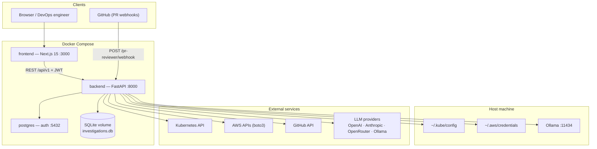
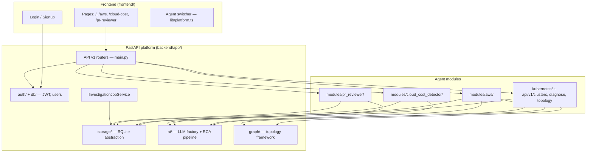
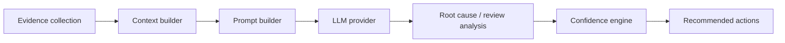
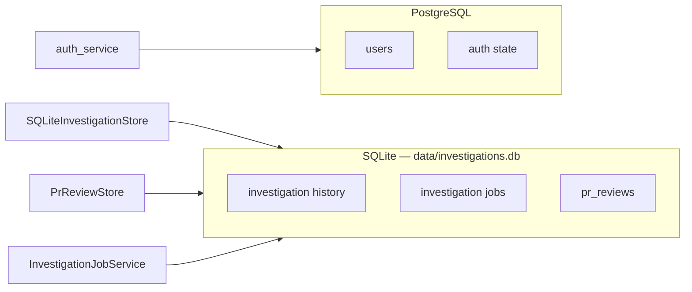
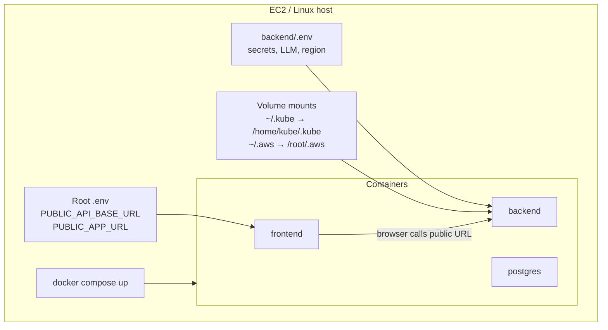
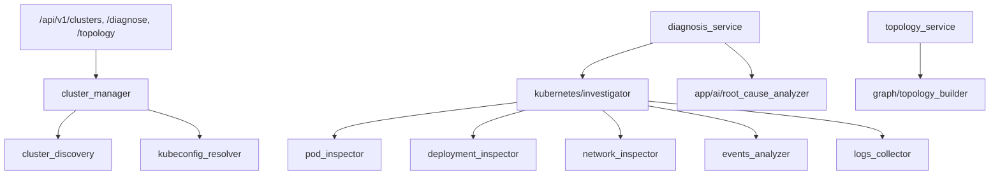
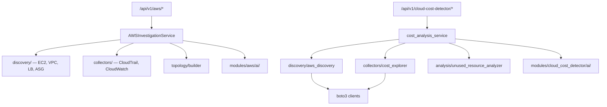
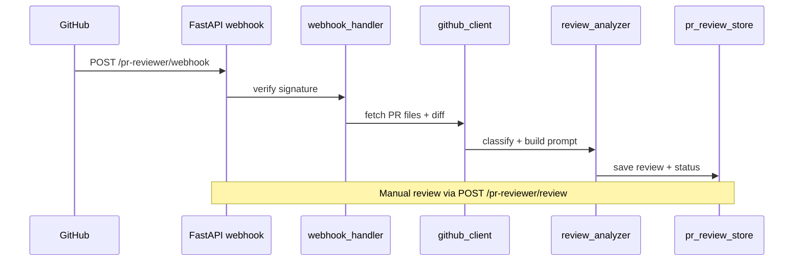

# DevOps Open Agent — Platform Architecture

Open Source · Self Hostable · Cloud Agnostic · Vendor Neutral

**Tagline:** Open Source AI-Powered DevOps Troubleshooting Platform

## System context



## Application layers



## Agent modules

| Module | Backend path | API prefix | Frontend routes |
|--------|--------------|------------|-----------------|
| **Kubernetes Debugging** | `kubernetes/`, `api/v1/clusters`, `diagnose`, `topology` | `/api/v1/clusters`, `/diagnose`, `/topology` | `/`, `/investigations`, `/topology` |
| **AWS DevOps** | `modules/aws/` | `/api/v1/aws/*` | `/aws`, `/aws/investigations`, `/aws/topology` |
| **Cloud Cost Detector** | `modules/cloud_cost_detector/` | `/api/v1/cloud-cost-detector/*` | `/cloud-cost`, `/cloud-cost/investigations` |
| **PR Reviewer** | `modules/pr_reviewer/` | `/api/v1/pr-reviewer/*` | `/pr-reviewer`, `/pr-reviewer/investigations` |

Agent configuration: `frontend/lib/platform.ts`

## Shared AI pipeline

Every agent follows the same analysis pattern:



**LLM providers** (configured in `backend/.env`):

```env
LLM_PROVIDER=openai|anthropic|ollama|openrouter
```

Implementation: `backend/app/ai/llm_factory.py`

Each module may add its own prompt builder and context builder under `modules/<agent>/ai/`.

## Data architecture



| Store | Technology | Purpose |
|-------|------------|---------|
| Auth | PostgreSQL (`POSTGRES_URL`) | Users, password hashes, JWT |
| Investigations | SQLite (`DATABASE_PATH`) | Per-agent investigation history with `agent_type` |
| PR reviews | SQLite (same file) | GitHub PR review records and status |

Storage factory: `backend/app/storage/factory.py`

## Deployment topology



Key deployment notes:

- Frontend bakes `NEXT_PUBLIC_API_BASE_URL` at **build time** — rebuild after changing public URLs.
- Kubeconfig localhost addresses are rewritten to `host.docker.internal` for in-container access.
- Do not set blank `AWS_PROFILE=` in `backend/.env`; use IAM role or host `aws configure`.

See [README — New host checklist](../README.md#new-host-checklist) for setup steps.

## Kubernetes agent internals



## AWS & Cloud Cost internals



## PR Reviewer internals



## Shared platform (reuse across agents)

| Layer | Current location | Notes |
|-------|------------------|-------|
| LLM providers | `backend/app/ai/` | Shared factory for all modules |
| Database | `backend/app/storage/`, `app/db/` | SQLite + Postgres split |
| Topology framework | `backend/app/graph/` | K8s + AWS topology graphs |
| Memory | `backend/app/memory/` | Stub for incident memory |
| Observability | `backend/app/observability/` | Stub collectors (Prometheus, Loki, etc.) |
| Auth | `backend/app/auth/`, `app/db/` | JWT middleware on protected routes |
| Agent framework | `backend/app/agents/` | Planner / investigator stubs |

## Investigation history

Shared history fields:

- Investigation ID
- **agent_type** (`kubernetes`, `aws`, `cloud-cost`, `pr-reviewer`)
- Timestamp, root cause, confidence, status

## Security

- Never expose API keys, secrets, or Kubernetes secret values in API responses.
- Never auto-execute remediation — human approval required.
- `backend/.env` is gitignored; use `backend/.env.example` as template.
- GitHub webhook signatures verified in `modules/pr_reviewer/github/signature.py`.

## Constraints

No vendor lock-in, proprietary dependencies, or closed-source services required for core operation.

## Adding a new agent

1. Add agent to `frontend/lib/platform.ts`
2. Create `backend/app/modules/<agent>/` with router, services, models
3. Register API router in `backend/app/main.py`
4. Implement discovery → investigation → topology → AI using shared `app/ai/`
5. Store investigations with `agent_type=<agent>`
